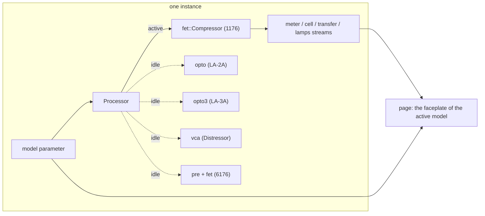

# Noob CompressorLab

Five classic compressors in one free plug-in by Noob Audio Engineering, built on
[noob-vst-webgui-framework](https://github.com/Noob-Audio-Engineering/noob-vst-webgui-framework).
Each instance is set to one model and the page draws the matching faceplate:

- the **1176**, a feedback FET compressor, in any of its nine revisions and three looks;
- the **LA-2A**, a tube optical leveller, with its big knobs, VU face and the T4 cell laid bare;
- the **LA-3A**, the solid-state successor: the same cell, driven far harder;
- the **Distressor**, a VCA compressor with eight curves, two distortion modes and British mode;
- the **6176**, the 610 tube preamp bolted to the front of the 1176;
- the **CL 1B**, the Danish tube optical one, whose time constants are on the panel rather than in the cell.

Flip the model switch and the same instance becomes another box; the switch is a parameter, so a
project remembers it.

They are humorous, affectionate spoofs of hardware I admire, and of the plug-ins people have made
of it. They are not parity replacements: the models come from published measurements, schematics
and the literature (the dossiers in [`research/`](research/) cite their sources line by line),
tuned until the test plan in each research document passes, and no further. Where a document's
test plan contradicts its own design table, or stops before it was written, the model's own
section below says so.

It shows what a product-sized plug-in looks like on the framework: the DSP, the standalone, the plug-in and the page all speak the same parameter and stream
layout, and everything that is *not* about compressing audio (the bridge, server, host adapter,
browser client, gestures, needle ballistics and charts) comes from noob-vst-webgui-framework.

## Layout

| path | what |
|---|---|
| `src/dsp/mod.rs` | the lab: `Model`, `Settings`, the parameter ids and specs, the streams, the `Processor` that hosts every engine and switches between them |
| `src/dsp/fet/` | the 1176: the oversampled feedback FET model, its revisions, knob maps and tests |
| `src/dsp/opto/` | the LA-2A: the T4 cell model, sidechain and tube stage, and its tests |
| `src/dsp/opto3/` | the LA-3A: the same cell with a transistor sidechain and a class-AB amplifier |
| `src/dsp/vca/` | the Distressor: the dB-domain feedback loop, its eight curves and its distortion generator |
| `src/dsp/pre/` | the 610 preamp stage, which with the 1176 behind it makes the 6176 |
| `src/dsp/opto1b/` | the CL 1B: its own optical element, the three-node attenuator and the three timing modes |
| `src/dsp/source.rs` | the standalone's demo signals (vocal, bass, drums, noises, tones) |
| `src/dsp/tests.rs` | tests of the lab itself: the contract, the switch, the telemetry |
| `src/plugin.rs` | the nih-plug VST3 / CLAP plug-in (feature `plugin`) |
| `src/bin/standalone.rs` | the dev server with a fake audio thread |
| `web/` | the Vue + Tailwind page, one view per model ([its README](web/README.md)) |
| `research/` | how the originals work and how they are simulated, and [`SURVEY.md`](research/SURVEY.md) for what to model next and why |



## Build, run, test

```sh
# the page
cd web && npm install && npm run build && cd ..

# standalone: demo sources through the active model, page on port 4244 (or the next free one)
cargo run --bin noob-compressorlab-standalone -- --open

# hot reload against the running standalone (proxies /ws and /instance* to it)
cd web && npm run dev

# the plug-in (embeds web/dist)
cargo build --release --lib --features plugin

# every model's test plan plus the lab's own tests
cargo test
```

### Bundling

The plug-in library (`target/release/noob_compressorlab.dll`, `.so` or `.dylib`) goes into
a bundle folder; I do it by hand on Windows:

```
noob-compressorlab.vst3/Contents/x86_64-win/noob-compressorlab.vst3        the .dll, renamed
noob-compressorlab.vst3/Contents/x86_64-linux/noob-compressorlab.so        Linux
noob-compressorlab.vst3/Contents/MacOS/noob-compressorlab                  macOS, plus an Info.plist
```

Copy the folder to the system VST3 directory (`C:\Program Files\Common Files\VST3`,
`~/.vst3`, `~/Library/Audio/Plug-Ins/VST3`). For CLAP, the same library renamed
to `noob-compressorlab.clap` in the CLAP directory. nih-plug's bundler does this with the
metadata filled in: `cargo install --git https://github.com/robbert-vdh/nih-plug.git cargo-nih-plug`,
then `cargo nih-plug bundle noob-compressorlab --release --features plugin`.

### Local framework development

To work on [noob-vst-webgui-framework](https://github.com/Noob-Audio-Engineering/noob-vst-webgui-framework) and this plug-in together, point
both dependencies at a checkout next to this repository:

```toml
# Cargo.toml, while developing (do not commit)
[patch."https://github.com/Noob-Audio-Engineering/noob-vst-webgui-framework"]
noob-vst-webgui-framework = { path = "../noob-vst-webgui-framework/crates/noob-vst-webgui-framework" }
noob-vst-webgui-framework-nih = { path = "../noob-vst-webgui-framework/crates/noob-vst-webgui-framework-nih" }
```

```sh
# the browser package: link the checkout's root package into web/
cd ../noob-vst-webgui-framework && npm link
cd ../noob-compressorlab/web && npm link @noob-audio-engineering/noob-vst-webgui-framework
```

The Vite config keeps the package out of the dependency pre-bundle, so a
linked checkout hot-reloads. Host-driven window resizing needs the patched
nih-plug this repository's `[patch]` section points at; keep that line.

## The model switch

`model` is a non-automatable parameter of the instance, and it has six positions:

| position | what it is | engine |
|---|---|---|
| `1176` | the FET compressor, in any of its nine revisions | `dsp::fet` |
| `LA-2A` | the tube optical leveller | `dsp::opto` |
| `LA-3A` | the solid-state optical leveller: the same cell, driven hard | `dsp::opto3` |
| `Distressor` | the feedback VCA compressor with eight curves and two distortion modes | `dsp::vca` |
| `6176` | the 610 tube preamp in front of the 1176 | `dsp::pre` and `dsp::fet` |
| `CL-1B` | the tube optical one whose timing is on the panel, not in the cell | `dsp::opto1b` |

The first two keep the positions they had, so a project saved before the lab grew still loads.

The `Processor` owns every engine; only the active one runs. When the switch flips, the engine
that becomes active starts from rest and takes over through a 20 ms crossfade while the outgoing
engine keeps running, so the change does not click. The active model's latency is reported to the
host and updated on a switch: 15 samples for the 1176 and for the 6176 (the 1176's 2x
oversampler), none for the others. The 6176's latency does not change with its routing switch,
because the 1176 engine runs in all three positions. The transfer curve is republished for the new
model, and the `cell` and `lamps` streams are zeroed once when a model that does not use them
takes over.

Every knob of every model is a parameter, so a project saves the whole lab. The prefixes are
`fet_` for the 1176, `opto_` for the LA-2A, `la3a_` for the LA-3A, `dist_` for the Distressor and
`pre_` for the 610 section of the 6176, whose compressor half reuses the 1176's `fet_` parameters,
and `cl1b_` for the CL 1B.
The four they all share (`link`, `mix`, `sc_hpf`, `bypass`) apply to whichever engine is active.

## Parameters

| id | range / labels | default | group | automatable |
|---|---|---|---|---|
| `model` | 1176, LA-2A, LA-3A, Distressor, 6176 | 1176 | lab | no |
| `fet_input` | 0..48 mark (= −48..0 dB) | 24 | 1176 | yes |
| `fet_output` | 0..48 mark | 24 | 1176 | yes |
| `fet_attack` | 0 (OFF)..7 | 4 | 1176 | yes |
| `fet_release` | 1..7 | 4 | 1176 | yes |
| `fet_ratio` | 4, 8, 12, 20, All | 4 | 1176 | yes |
| `fet_meter` | GR, +4, +8, Off | GR | 1176 | no |
| `fet_revision` | A, B, C, D, E, F, G, H, LN | LN | 1176 | no |
| `opto_gain` | 0..100 (unity at 32, +40 dB at 100) | 32 | LA-2A | yes |
| `opto_peak_reduction` | 0..100 | 40 | LA-2A | yes |
| `opto_mode` | Compress, Limit | Compress | LA-2A | yes |
| `opto_meter` | Gain Reduction, Output +10, Output +4 | Gain Reduction | LA-2A | no |
| `opto_emphasis` | 0..1 (R37) | 1 | LA-2A | yes |
| `opto_cell` | Silver, Gray, LA-2 | Gray | LA-2A | no |
| `opto_meter_zero` | −2..2 dB (the panel trim) | 0 | LA-2A | no |
| `la3a_gain` | 0..100 | 32 | LA-3A | yes |
| `la3a_peak_reduction` | 0..100 | 40 | LA-3A | yes |
| `la3a_mode` | Compress, Limit | Compress | LA-3A | yes |
| `la3a_meter` | Gain Reduction, Output, Off | Gain Reduction | LA-3A | no |
| `la3a_emphasis` | 0 (flat, as it ships)..1 (full HF Contour) | 0 | LA-3A | yes |
| `la3a_cell` | Fresh, Used, Tired | Fresh | LA-3A | no |
| `cl1b_gain` | −80 to +30 dB, the pot's own log law | 0 dB | CL 1B | yes |
| `cl1b_ratio` | 0 to 100 % of travel between the two printed stops | 37.5 % | CL 1B | yes |
| `cl1b_threshold` | +11.6 down to −40 dBu, the same log law mirrored | −19.2 dBu | CL 1B | yes |
| `cl1b_attack` | 0.5 to 300 ms, log | 60.6 ms | CL 1B | yes |
| `cl1b_release` | 0.05 to 10 s, **linear** | 2.54 s | CL 1B | yes |
| `cl1b_mode` | Fixed, Fix/Man, Manual | Manual | CL 1B | yes |
| `cl1b_meter` | Input, Compression, Output | Compression | CL 1B | no |
| `cl1b_bus` | Off, 1, 2 | Off | CL 1B | yes |
| `cl1b_power` | the panel's mains knob | on | CL 1B | no |
| `dist_input`, `dist_output` | 0..10.5 (unity at 5) | 5 | Distressor | yes |
| `dist_attack` | 0..10.5 (50 µs..30 ms at 10) | 5 | Distressor | yes |
| `dist_release` | 0..10.5 (50 ms..3.5 s at 10) | 5 | Distressor | yes |
| `dist_ratio` | 1:1, 2:1, 3:1, 4:1, 6:1, 10:1, 20:1, Nuke | 6:1 | Distressor | yes |
| `dist_detector` | Norm, HP, Band, HP+Band | Norm | Distressor | yes |
| `dist_audio` | Norm, HP, Dist 2, Dist 3, HP+Dist 2, HP+Dist 3 | Norm | Distressor | yes |
| `dist_british` | toggle | off | Distressor | yes |
| `dist_link_mode` | Phase, Image, Both | Phase | Distressor | no |
| `dist_headroom` | 4..28 dB | 16 | Distressor | no |
| `pre_join` | Join, BP, 1:1 | Join | 6176 | yes |
| `pre_gain` | −10, −5, 0, +5, +10 | 0 | 6176 | yes |
| `pre_input` | Line, Mic 500, Mic 2.0K, Hi-Z 47K, Hi-Z 2.2M | Line | 6176 | no |
| `pre_pad` | toggle (microphone inputs only) | off | 6176 | yes |
| `pre_polarity` | toggle | off | 6176 | yes |
| `pre_level` | 0..10 (unity at 5, +20 dB at 10) | 7 | 6176 | yes |
| `pre_lf_freq` | 70, 100, 200 Hz | 100 | 6176 | yes |
| `pre_lf_gain` | −9..+9 dB in eleven steps | 0 | 6176 | yes |
| `pre_hf_freq` | 4.5k, 7k, 10k | 10k | 6176 | yes |
| `pre_hf_gain` | −9..+9 dB in eleven steps | 0 | 6176 | yes |
| `pre_hpf` | toggle (75 Hz low cut) | off | 6176 | yes |
| `pre_voice` | 610B, 610A | 610B | 6176 | no |
| `pre_load` | 15k, 600 | 15k | 6176 | no |
| `pre_meter` | PRE, GR, COMP | GR | 6176 | no |
| `pre_phantom` | toggle (+48 V) | off | 6176 | no |
| `link` | toggle | on | extras | yes |
| `mix` | 0..100 % | 100 | extras | yes |
| `sc_hpf` | 0 (off)..300 Hz | 0 | extras | yes |
| `bypass` | toggle | off | extras | yes |
| `src_kind` | Vocal, Bass, Drums, Pink noise, White noise, Saw, Sine | Vocal | source (standalone only) | no |
| `src_level` | 0..1 | 0.4 | source | no |
| `src_freq` | 20..20000 Hz, log | 110 | source | no |

The 1176's Input and Output marks are attenuation from fully clockwise: mark `m` is `m − 48` dB,
so 24 / 24 is unity. Attack marks 1..7 map geometrically to 800..20 µs, Release marks to
1100..50 ms, and 0 on Attack is the OFF detent. The LA-2A's Peak Reduction is a sidechain drive
calibrated so 30 gives 1 dB of reduction at 0 VU; the LA-3A's is calibrated so that the middle of
the knob on a −12 dBFS programme lands on the 4 dB its manual asks for. The Distressor's four
knobs read 0 to 10 with a little over-travel and the numbers are arbitrary, as on the hardware;
the 610's Level knob is the same.

## Streams

| id | kind | values | rate | contents |
|---|---|---|---|---|
| `meter` | meter | 6 | every block | `[in_l, in_r, out_l, out_r, gr_db, meter_vu]`: linear peaks (1.0 = 0 dBFS), the gain change in dB (≤ 0 for every model), and what the active model's panel meter reads in dB |
| `cell` | raw | 3 | every block while the LA-2A or the LA-3A is active | `[light, free_carriers, trapped_carriers]`, 0..1 |
| `transfer` | curve, sticky | 128 | on change | the active model's static output level in dBFS for a sine at −60..0 dBFS |
| `lamps` | raw | 4 | every block while the Distressor or the 6176 is active | `[thd_pct, redline, pre_vu_db, drive]` |

`meter_vu` is **where the needle is**, not what it is chasing. Both research documents ask for the
standard VU movement, 99 % of the deflection in 300 ms with 1 to 1.5 % of overshoot, and both insist
it lives in the audio thread so the meter cannot depend on how often the page repaints; `src/dsp/vu.rs`
is that movement and every model runs its meter through it. A page draws this field as it arrives.
Smoothing it again would double the ballistics, which is what used to happen: the browser was
applying its own default damping of 0.62, about 8 % of overshoot against the standard's 1.5 %.

What the needle chases depends on the meter switch. In the GR positions it is `gr_db`, so the needle
rests at 0 and swings left. In the output positions it is the VU reading of the block's mean
rectified output against 0 VU = −18 dBFS (the `+4` positions, `vu_ref_dbfs` in the manifest); the
1176's `+8` reads 4 dB lower and the LA-2A's `Output +10` 6 dB lower; the LA-3A's `Off` rests the
needle. The 6176's `PRE` position reads the preamp's own meter, whose 0 VU is +4 dBm at the preamp
output. The LA-2A's `opto_meter_zero` trim moves its needle and nothing else, as the screw on the
front panel does.

**The 1176's METER OFF is its power switch.** The manual is explicit that OFF "powers the unit off;
pressing any other meter button powers it on", and no revision has a separate power control, so OFF
passes the input through and parks both the meter and the reduction read-out.

`lamps` carries what the two newer faces need and no needle can show: the Distressor's estimated
generator distortion in per cent, a flag for its REDLINE lamp (the 1 % lamp is the same number
against 1 %), the 610 section's PRE meter reading in dB and its input stage's drive, where 1 is
the stage's own saturation point. Both the `cell` and `lamps` streams publish one frame of zeros
when a model that does not use them takes over, so a page never draws a stale cell or a stuck lamp.

## The 1176

A voltage-domain **feedback** compressor: the sidechain is fed from the preamp output, a
single-capacitor diode detector whose diode bias *is* the threshold, a FET control law with a
linear-then-saturating dB-per-volt curve, the FET divider with a signal-dependent (second- and
third-order) resistance, preamp and line-amp soft saturation, an output-transformer high-pass, the
"all buttons in" operating point and stereo linking, all at 2x oversampling. Section 7 of
[`research/1176.md`](research/1176.md) has the equations; `src/dsp/fet/compressor.rs` the
constants that were tuned against the tests.

### Revisions

`fet_revision` selects a circuit and, on the page, a faceplate look. Revisions that share a circuit
share constants (C = D = E, G = H). LN is the default: it is the unit still made, the one the
measurements I lean on were taken from, and it shares the C / D / E circuit, so the default sound is
the classic black face either way.

| revision | years | look | circuit |
|---|---|---|---|
| A | 1967 | Bluestripe (silver, blue meter block) | FET preamp, no low-noise circuit: noisiest, most second harmonic |
| B | 1967 to 1970 | Bluestripe | bipolar preamp, still no LN circuit |
| C | 1970 | Blackface | the LN circuit as a potted module |
| D | to 1973 | Blackface | the LN circuit on the main board; the reference black face |
| E | 1973 | Blackface | D with a switchable mains transformer; identical sound |
| F | 1973 on | Blackface | push-pull class-AB output stage and a new output transformer; lowest THD |
| G | later | Blackface | electronically balanced input replaces the input transformer |
| H | later | Silverface | cosmetic only: the G circuit |
| LN | the reissue | Blackface | C / D / E with a modern noise floor |

The measured THD at 10 dB of reduction, from the test plan:

| A | B | C/D/E | F | G/H | LN |
|---|---|---|---|---|---|
| 1.58 % | 1.21 % | 0.24 % | 0.19 % | 0.19 % | 0.24 % |

## The LA-2A

A grey-box model of the optical leveling amplifier: the T4 cell as an electroluminescent panel
driving a CdS photocell with trapped carriers (the slow, memory-laden second release stage), a
sidechain whose Peak Reduction drives the panel, the R37 emphasis shelf, the feedback / feed-forward
share that makes Limit differ from Compress, and a gentle tube stage. Section 7 of
[`research/LA-2A.md`](research/LA-2A.md) has the derivation; `src/dsp/opto/model.rs` the constants.
The three `opto_cell` variants scale the cell's speed (Silver 0.7, Gray 1.0, LA-2 1.6).

## The LA-3A

The 1969 solid-state successor, and the machine that killed the LA-2A. `research/LA-3A.md` sums it
up in one sentence: the cell stayed, everything around it got faster, louder, wider and smaller.
So this engine reuses the LA-2A's T4B cell and rebuilds the rest around it.

| | LA-2A | LA-3A |
|---|---|---|
| gain element | T4B cell | **the same cell**, imported rather than copied |
| sidechain | a tube from a high-voltage rail | a transistor through a step-up autotransformer, driven far harder |
| panel smoothing | 1 ms | 0.25 ms, because a low-impedance driver charges it faster |
| attack | 10 ms | 1.5 ms or less |
| release | 60 ms to half, then 0.5 to 5 s | word for word the same |
| shaping | R37, one gentle tilt | two real high-passes at 100 and 30 Hz, plus HF Contour |
| amplifier | 12AX7A and a 12BH7A follower | class-AB transistors: cleaner, symmetric, with a crossover deadband |
| meter | GR, Output +10, Output +4 | GR and Output only, plus the plug-in's Off |

**The cell is imported, not copied.** The hardware uses the same T4B module in the same role and
the divider around it is the LA-2A's circuit to within a few per cent, so `dsp::opto3` uses
`dsp::opto::model::Cell` directly and only the constants around it change: a shorter panel
smoothing time and a hotter drive. Two hand-tuned copies of the same photocell would drift apart,
so two tests assert that every release constant is the cell's own and that only the panel and the
generation constant differ.

**Two side-chain high-passes are the whole personality.** A 4.7 nF coupling capacitor and the
driver's autotransformer make the detector deaf below about 100 Hz, so bass does not pump the gain,
and the HF Contour trimmer lifts the top by up to 10 dB at 15 kHz. The mid-forward reputation falls
out of those two; the audio path itself is flat within a decibel from 20 Hz to 20 kHz, and there is
a test for each half of that claim.

**The threshold is the published one.** UREI printed a limiting threshold of −10 dBm at the 30 dB
position and −30 dBm at the 50 dB position. Those differ by exactly the rear input pad, so one
constant reproduces both, and the model is calibrated to it rather than to a soft target the way
the LA-2A had to be. The pad itself is not a parameter: the model is fixed at the 50 dB position.

`la3a_emphasis` runs 0 (flat, where the trimmer ships) to 1 (full contour). That is the opposite
sense to the LA-2A's `opto_emphasis`, where 1 is flat, because they are different circuits and the
panels label them differently. A copy-paste from the other engine would invert it silently while
every other test still passed, so there is a test that asserts the direction on its own.

Compress and Limit differ by one blend coefficient, and that coefficient is **tuned against the
published ratios, not read off the schematic**: the scan will not resolve which terminal of the
switch is the common one, and the obvious reading predicts a tenth of a decibel between the two
modes, which cannot be right. The code says so where the constant is defined.

## The Distressor

A feedback VCA compressor computed in the dB domain. The eight ratio positions are eight different
curves, not one curve with a slope control: the knee width, the effective slope and the release
shape all change, and `research/Distressor.md` section 7.4 is the table this implements.

| position | threshold | knee | slope | release |
|---|---|---|---|---|
| 1:1 | none | | 1 | the distortion modes on their own |
| 2:1 | −6 dB | 30 dB, the widest thing in the box | 2.3 | standard |
| 3:1 | −8 dB | 24 dB | 3.3 | standard |
| 4:1 | −12 dB | 12 dB | 4.5 | standard |
| 6:1 | −14 dB | 10 dB | 6.5 | standard |
| 10:1 | −16 dB | 8 dB | 10 | two stages, stretching towards 20 s |
| 20:1 | −18 dB | 3 dB | 20 | quicker than the knob asks |
| Nuke | −16 dB | 1.5 dB | 40 | logarithmic: fast, then slowing |

Two notes on how this is built, because a feedback compressor does not work the way the textbook
gain computer does. The detector hears the **compressed** signal, so a loop of slope `s` closes to
an input-to-output ratio of `1 − s`: the printed 20:1 needs a loop slope of −19, not the
feed-forward `1/R − 1`. That is the high loop gain the hardware's control amplifier provides, and
it is why a feedback design can limit at all. The step is then divided by `1 + |s|` before it is
applied, which the loop multiplies back, so the closed loop settles with exactly the time constant
the knob asks for. Without that, a fast attack at a high ratio would be a loop gain of twenty and
would ring.

The knee widths above are what a measurement of the finished box would show, so they are
input-referred: the knee starts half a width below the threshold, and the width inside the loop is
compressed by the same factor the loop stretches it by.

**Where I differ from the research document.** Its test plan says the input level for 1 dB of gain
reduction rises from 2:1 through 20:1. Its own curve table says the opposite, and the table is the
more specific statement, so I implemented the table: the higher ratios engage earlier, which is
also what the 2:1 position's famously invisible first few decibels imply.

The Audio switch's Dist 2 and Dist 3 are a Chebyshev-voiced generator after the gain cell: Dist 2
is predominantly second harmonic up to about 3 %, Dist 3 predominantly third up to about 20 %. The
drive rises with a slow attack, a fast release and British mode, and the `lamps` stream carries the
estimate that lights the 1 % and REDLINE lamps. British mode replaces whatever the ratio switch
says with a raised threshold, a slope in the 10 to 20 range, sped-up timing, an onset lag and more
grunge, after the 1176's all-buttons treatment.

## The 6176

The 610 is a tube microphone preamp with a two-band shelving equaliser, not a compressor, so it
earns its place in a compressor lab the way Putnam gave it one: bolted to an 1176. The `6176`
position runs the 610 stage into the 1176 engine.

The Gain switch is the interesting control. It trades attenuation for negative feedback, so
turning it up does not only make the stage louder, it makes it dirtier; that is the whole reason
the 610 has two gain controls instead of one. The chain per channel is the input select and pad,
the input transformer, the input tube stage, the Level pot, the two shelves, the output tube stage,
the output transformer (whose core saturates on low frequencies at a level where the midrange is
still clean), the polarity switch and an optional low cut.

The Ratio switch's two extra positions are routing, and the 1176 engine runs in all three so the
latency never changes:

| position | what happens |
|---|---|
| `Join` | the preamp feeds the compressor |
| `BP` | the preamp goes straight out, and the compressor is a delay-matched pass-through |
| `1:1` | the compressor runs with no gain reduction, but its amplifiers still colour the signal |

`pre_voice` picks the 610B of the 6176 or the 1958 610A module, which has three Gain positions
instead of five, a −20 dB pad, fixed equaliser corners, more second harmonic and a more closed
top. The shelves are first-order, and the number printed on the panel is the half-gain point, so a
±9 dB step is ±4.5 dB at the corner and reaches its full value about a decade away.

## The CL 1B

The other two optical models put their timing in the cell. This one does not, and that is the whole
machine: its attack and release are an op-amp, a 10 µF capacitor and two front-panel pots, so the
attack runs from 0.5 to 300 ms and the release from 50 ms to ten seconds, neither of which a T4 can
be made to do.

So it does **not** share the T4 cell, and there is a test whose only job is to prove that. Importing
it would drag in a 60 ms first-stage release, a half-second trap and the programme memory, the
bottom half of the Release knob would stop doing anything, and this would quietly become a third
LA-2A with extra knobs. What it does share is the static photoconductive law, the filters, the VU
reference and the hygiene.

Three things are worth knowing before turning the knobs.

**The Ratio control is not a ratio control.** It is a 10 kΩ rheostat sitting between the node the
detector listens to and the node the cell shunts. Wound anticlockwise the two are the same node and
the feedback loop is complete; wound clockwise the detector's view of the reduction saturates, the
loop stops fighting back, and the audio reduction runs away. That is why the panel prints only 2:1
and 10:1, with nothing in between, which is honest of them.

**The release taper is linear, and almost nothing else is.** P5 is a linear pot, so at the 10
o'clock setting Lydkraft recommend for vocals the release is about 2.5 seconds, where a logarithmic
taper of the same range would have given about 350 ms. That single component value changes the
character of every published setting, and it is the reason the research read the pot codes off the
schematic rather than assuming.

**Fix/Man is not a blend of the other two.** Its attack is always the fixed 1 ms, whatever the
Attack knob says; the knob becomes a *delay*, over the same range, controlling how long the fast
release runs before the slow one takes over. And it gives up on peaks longer than that delay,
responding as Manual would. Two tests exist for that alone, because it is the easiest thing on the
machine to get wrong.

Two calibrations from the service manual pin the model, and between them leave almost no freedom:
+250.0 mV at the side-chain jack must give exactly −10.0 dB, and the Gain control's maximum must be
exactly +30.0 dB. Both are solved numerically at construction rather than written down, so they stay
true if a resistor value is ever corrected.

The four continuous knobs publish their **real units**, with a lookup table sampled from the
engine's own pot laws, so the page and the host both read decibels, dBu, milliseconds and seconds
straight from the manifest. The normalised value stays linear in pot travel, which is what a knob
turns by and what the panel's measured scale dots are fractions of. The point of doing it this way
is that each law exists exactly once, in the engine: the alternative was reimplementing four tapers
in JavaScript, and two copies of one law is how the equaliser next door came to draw a curve that
disagreed with its own audio by nearly two decibels. Ratio is the exception and publishes travel,
because the research is explicit that its printed 2:1 and 10:1 are labels rather than slopes and the
real behaviour is a ratio that rises with depth, so an interpolated plain value would be a number
the machine does not have. It carries a unit all the same, so a host's automation lane shows a
percentage between two named stops rather than a bare fraction.

Every model's parameters now render as its panel is marked when a host lists them: the 1176's skirt
is printed in attenuation, so the figure shown is 48 minus the parameter, and the two optical panels
are marked 0 to 10 where their parameters run 0 to 100. Those are display forms only. The stored
values and ranges are untouched, so nothing a project already saved has moved.

There is deliberately **no cell-age control**, unlike the LA-2A's and the LA-3A's. Lydkraft claim no
long-term degradation of the element, owners report units are all alike, and nobody has published a
contrary observation. Inventing one would be inventing a fact.

The panel's OFF/ON mains knob parks the machine rather than silencing it. A real CL 1B with its
mains off passes nothing, because its audio path runs through the tube stages; this one passes the
input through and parks the meter, which is what the 1176 in this same plug-in does when its meter
switch is turned to OFF. Two power switches inside one product behaving differently would be worse
than either choice alone.

### Two figures the research proposed and the model does not use

Both are recorded here because they were changed deliberately, not discovered by accident.

The research proposed reusing the T4's photoconductive exponent of 0.8, which comes from the CdS
literature. But its own section 4 establishes that this element is not a T4 and that nobody outside
Lydkraft knows what is inside it, so that number is a guess about a different part. Meanwhile the
manual publishes a figure the exponent controls: at the 2:1 stop, ten decibels more in gives five
more out. In a feedback loop the output slope is `1/(1 − p)` where `p` is the sensitivity of the
attenuation to the drive, so 2:1 needs `p = −1`; at 0.8 the loop settles near 1.5:1 and cannot reach
the published figure at any depth. The exponent is therefore **solved from the published ratio**,
and the value that results sits just above the CdS range, which is unsurprising for a part that is
not a CdS cell.

The research also proposed clamping the drive ratio to one. That would have capped the model at the
10 dB calibration point, while its own minimum-resistance constant exists precisely to set the
maximum reduction, so the clamp belongs on the resistance instead.

## Where the models miss their published figures

Three audits went through these engines against their research documents and found tests that had
been written to assert the model's own output instead of the figure they existed to check. Those are
fixed: a test that exists to check a published number now asserts that number, and where the model
cannot meet one, the gap is recorded here and in a comment at the test rather than legislated away.
Seven remain.

| model | published | measured | why |
|---|---|---|---|
| 1176 | attack 7 below 60 µs at the 63 % criterion | about 350 µs | the knob map reaches 20 µs, but the closed loop adds the detector's own charging time and nothing compensates for it |
| 1176 | soft knee, first 3 dB at least 30 % gentler than 10 dB up | about 8 % gentler at 4:1, and very slightly hard at 8:1 and 12:1 | the knee is whatever the diode detector's curvature makes it; nothing shapes it further |
| 1176 | attack OFF below 0.1 % distortion at −18 dBFS | 0.14 % | the preamp and line amp are both a little into their curves at the 24 / 24 setting |
| 610 | no alias above −80 dB with a 15 kHz tone into a hot microphone setting | −34.6 dB at the Gain switch's top | a hard-clipped 15 kHz tone has more harmonics than first-order anti-aliasing removes; the pad on the front panel exists for exactly that setting. **The figure was −51 dB here until the benchmark swept the whole band below 10 kHz rather than checking selected products: the worst is the third harmonic folded to 3 kHz, a discrete tone 48 dB above its neighbours, which the narrower measurement had missed** |
| 610 | +0 / −1 dB from 20 Hz to 20 kHz | met at 48, 96 and 192 kHz; −2.2 dB at 20 kHz at 44.1 kHz and −1.1 dB at 88.2 kHz | **this used to miss at every rate and now misses only on the 44.1 kHz family.** Two faults were behind it. The two modelled transformer roll-offs spent 1.61 dB of the 1 dB budget between them, and the research says in as many words that their corners were "chosen to keep the B response within +0 / −1 dB", which that arithmetic never reached; they now sit where that stated purpose puts them. And the stage stopped oversampling at and above 88.2 kHz, which dropped the shaper's own rate and made the response *worse* at high rates than at low ones, so the factor now follows the host. What is left is the resampler's own passband droop: 20 kHz sits at 91 % of Nyquist at 44.1 kHz and at 45 % of the half-band's cutoff at 88.2 kHz, against 42 % at 96 kHz. Buying it back means a longer half-band and more latency, in code the 1176 engine shares, which is a trade rather than a fix |
| LA-3A | 40 dB of gain reduction at Peak Reduction 10 | about 34 dB at the published drive, reaching 40 dB only with 12 dB more | in Compress every decibel of reduction takes a decibel off the side-chain, so the loop starves itself: measured, depth rises about 4.3 dB for every 6 dB of extra drive. Limit reaches 40 dB at the published level, and both figures are asserted |
| CL 1B | at the 2:1 stop, ten decibels in gives five out at every depth from 3 dB | 5.2, 4.8 and 4.8 dB from 8 dB of reduction and deeper; 6.4 dB from 3 dB | a feedback optical compressor has a soft knee near its threshold, which is what the reviews describe; the manual's sentence is a description of what the Ratio control selects rather than a knee specification |

The 610's tube stages use **first-order antiderivative anti-aliasing**, which its research prescribes
for this symptom in preference to a bigger oversampling factor. It was right about the mechanism: the
anti-aliasing bought 24 dB where doubling the factor bought two. The shaper's antiderivative is
elementary only for integer exponents and the stages use 2.5, 3.5 and 4, so it is tabulated per
voicing and read back by interpolation (`src/dsp/pre/adaa.rs`). The stage still runs at 4x rather
than the 2x the research asks for, but for the response and not the aliasing: averaging the shaper
across each segment is itself a mild low-pass, and at 2x it costs 1.7 dB at 12 kHz against a
published +0 / −1 dB.

Two of the research documents also contradict themselves, and the code says which half it follows and
why: the Distressor's threshold ordering (its section 4.2 against its test plan) at the curve table
in `src/dsp/vca/compressor.rs`, and the LA-3A's HF Contour direction (its 4.5 against its 7.3) at
`Settings::emphasis` in `src/dsp/opto3/engine.rs`. The 610's own test plan asks for two things that
cannot both hold, 3 to 8 % distortion at +15 dBu and a 30 Hz figure at +18 dBu that is both three
times the 1 kHz figure and under 5 %; the ratio is what says something about the transformer, so the
ratio is what is asserted, and the note is at the test.

## Tests

`cargo test` runs 152 tests (one more is `#[ignore]`d and prints curves):

- **the lab** (`src/dsp/tests.rs`): the parameter contract (ids, labels, defaults, stream layout);
  shared values reach every engine; every model compresses and reports `gr_db` ≤ 0 with the GR meter
  equal to it; the output meter modes read 0 VU at −18 dBFS; switching models
  crossfades without a sample-to-sample jump and settles to the new model's steady state; forty
  switches back and forth stay finite; cycling all five stays finite and quiet; the transfer curve
  follows the active model; the `cell` and `lamps` streams speak only for the models that have
  them; the 6176's routing switch compresses, unities and bypasses without changing the latency,
  and its meter switch picks its source; every demo source plays;
- **the 1176** (`src/dsp/fet/tests.rs`): ratios hold within 20 % above onset; 20:1 is nearly flat;
  the input knob drives compression and 24 / 24 is unity; attack and release follow the knobs; all
  buttons in raises the threshold, lags and distorts more; LN is clean and the blue stripes add
  second harmonic; every revision is bounded and ordered as the sources say; bypass is transparent
  and mix blends; numerically robust; sample-rate invariant; stereo link shares one detector; the
  meter reads GR and VU; the transfer curve matches the engine within a couple of dB; the
  oversampler round-trips at unity with the stated latency;
- **the LA-2A** (`src/dsp/opto/tests.rs`): bypass is transparent and the tube stage clean; steady
  reduction follows Peak Reduction and level; ratio and knee differ between Compress and Limit;
  attack is about ten milliseconds and level dependent; release has two stages; the cell remembers
  long hard compression; highs get more reduction and R37 shapes the lows; distortion under
  reduction is odd and modest; stereo link shares one cell; numerical hygiene; sample-rate
  independent; the transfer curve is monotonic and matches the solver; make-up is unity at 32 and
  +40 dB at full; the meter reads the reduction and the output;
- **the LA-3A** (`src/dsp/opto3/tests.rs`): bypass is exact and Peak Reduction 0 compresses nothing
  at any level; the audio path is flat within a decibel from 20 Hz to 20 kHz; the threshold of
  limiting is the published −30 dBu at all three sample rates; the manual's working point lands
  where the manual puts it; the static curve is monotonic in level and in Peak Reduction and stops
  at about 40 dB; Limit parts company with Compress only in deep compression; the attack is inside
  the published bracket and depends on the size of the step; the release has two stages and the
  cell remembers a long passage; the detector is deaf to the bottom end; the contour runs from flat
  to ten decibels **and in that direction**; the output stage is clean but makes both an even and
  an odd harmonic; the meter switch has the positions the hardware has; and, against the LA-2A on
  the same input, it shares that model's cell rather than copying it, attacks three times faster
  from the same steady reduction, and ignores bass far more;
- **the Distressor** (`src/dsp/vca/tests.rs`): the knob maps hit the published ranges; 1:1 does not
  compress; every ratio's measured slope matches its curve; 20:1 and Nuke hold the output within a
  decibel over a ten-decibel range; the 2:1 knee is the widest and the 20:1 knee narrow; a bigger
  overshoot is caught faster; the attack and release knobs order onset and recovery; the 10:1
  position lets go the most slowly; British mode raises the threshold and delays the first decibel;
  Dist 2 leads with the second harmonic and Dist 3 with the third, and clean mode is clean; the
  lamps follow the drive; the audio high-pass cuts only lows; the detector filters change only the
  side-chain; the link modes behave as documented and the dead patch distorts more; bypass is
  exact; numerical hygiene; the transfer curve matches the engine; sample rates agree;
- **the 610** (`src/dsp/pre/tests.rs`): unity, flat and clean at nominal settings; the Gain switch
  steps 5 dB and the 610A's HI is +8; the Level table lands on its marks; the input select and pad
  move the gain, the pad only on the microphone inputs; polarity inverts exactly; each shelf step
  is reached far from the corner and half reached at it, and 0 is an exact bypass; the high shelf
  leaves the bass alone; the Gain switch changes the distortion at a fixed output level and the
  second harmonic leads; the output stage has a ceiling and climbs from 0.1 % to 5 % in about ten
  decibels; the output transformer bends only the bottom and keeps out of the way at nominal level;
  the 610A is dirtier and darker; the low cut and the load switch do what they say;
  self-rectification lingers after a loud passage; the PRE meter reads 0 VU at the reference; the
  tube curve is normalised and monotonic; numerical hygiene.

- **the CL 1B** (`src/dsp/opto1b/tests.rs`): 29 tests from its research's own plan, every one naming
  the published figure it asserts and where that figure comes from. The two service-manual
  calibrations; the panel's threshold dots; that the Gain knob cannot touch the compression; the 2:1
  step and the Ratio control's range and monotonicity; the bandwidth and the 40 Hz distortion at both
  published levels; the fixed, manual and Fix/Man timings including the trap that Fix/Man's attack is
  the fixed one and that it gives up on long peaks; the meter's calibration; that the bus takes the
  larger reduction rather than the average; and the structural test whose only job is to prove the T4
  cell was not imported, which is the one that stops this becoming a third LA-2A.

### The cell switches, and what is actually known about the three eras

The LA-2A's three cell variants and the LA-3A's three cell ages both have tests asserting they
change the sound in the documented order, because a wired control with nothing testing it is how a
dead one goes unnoticed.

The LA-2A's span stays at a factor of about 2.3, and the reasoning is recorded at the constants
because it is not obvious. Three things are known, and they do not all point the same way.

The only *ordering* of the eras by speed is Universal Audio's product description: Silver fast, Gray
the medium reference, the LA-2 slowest and mellowed by fifty years of panel ageing. That is a
manufacturer's qualitative claim, not a measurement, and it is what these multipliers follow.

The only *measurement* is Moore's six units, whose attack and release spreads of about 2.5 and 3.7
are wider than ours. It would be wrong to borrow, because the same measurement reports no consistent
vintage-versus-reissue grouping: that spread is unit-to-unit variation conflating cell age,
tolerance and calibration, so sizing an era switch from it would attribute to the three cells a
variation its own source says the three cells do not explain.

The one *physical, era-specific* difference runs the other way entirely, and it **is** modelled. The
T4A in the LA-2 and early LA-2A, and very early T4Bs, carried three photocells rather than two: the
main pair plus a fast one in parallel, giving a dual time constant that broadcast engineers liked.
Later T4Bs, which is the Silver position and every reissue, dropped it. So the LA-2 position has a
second, faster carrier population feeding the same divider, and it behaves as it should: measured, it
recovers more of its reduction than Gray in the first 20 ms, less by 100 ms once the fast cell has
done its work, and less again at three seconds. No single speed multiplier can be ahead early and
behind later, which is why the test asserts that shape rather than a total speed.

Its share of the conductance is an estimate, because the sources give the cell's existence, its
direction and its topology but not its magnitude. It is deliberately secondary: the one person who
examined the modules concluded the overall response is dominated by the slower photocell, so the
early recovery never overtakes Silver's, and a test asserts that too.

So the ordering is documented, the magnitude is not, the span is not widened to make the control feel
more useful, and the one difference with a physical basis is modelled as the structural thing it is.
Silver and Gray are bit-for-bit unchanged, with a test guarding it, because the LA-3A shares this
cell.

## Presets and the UI store

The page keeps its presets (per model) and the window size in the UI store. The standalone
persists the store in a file through the framework's `FileStore`; the plug-in saves the same data
inside its host state through a `StoreSlot`, so a project reopens with the presets and the window
the instance had.

## Page

The page is one Vite SPA with a shared shell (model switch, presets, fullscreen, edit-echo
read-out, bypass) and one view per model; see [`web/README.md`](web/README.md) for the looks, the
components, the dev manifest that lets the page render without a plug-in, and window sizing.

## Further reading

- [`research/1176.md`](research/1176.md): how the 1176 works and how it is simulated, with sources.
- [`research/LA-2A.md`](research/LA-2A.md): the same for the LA-2A.
- [`research/LA-3A.md`](research/LA-3A.md), [`research/Distressor.md`](research/Distressor.md),
  [`research/610.md`](research/610.md) and [`research/CL-1B.md`](research/CL-1B.md): the same for
  the other four.
- The framework's [guides](https://github.com/Noob-Audio-Engineering/noob-vst-webgui-framework/tree/main/docs) for the bridge, streams, store and host adapter
  this plug-in is built on.
