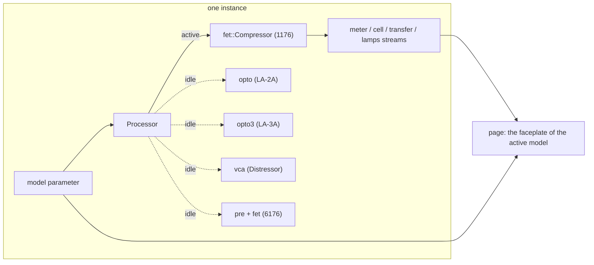

# Noob CompressorLab

Five classic compressors in one free plug-in by Noob Audio Engineering, built on
[noob-vst-webgui-framework](https://github.com/Noob-Audio-Engineering/noob-vst-webgui-framework).
Each instance is set to one model and the page draws the matching faceplate:

- the **1176**, a feedback FET compressor, in any of its nine revisions and three looks;
- the **LA-2A**, a tube optical leveller, with its big knobs, VU face and the T4 cell laid bare;
- the **LA-3A**, the solid-state successor: the same cell, driven far harder;
- the **Distressor**, a VCA compressor with eight curves, two distortion modes and British mode;
- the **6176**, the 610 tube preamp bolted to the front of the 1176;
- the **CL 1B**, the Danish tube optical one, whose time constants are on the panel rather than in the cell.

Flip the model switch and the same instance becomes another box; the switch is a parameter, so a
project remembers it.

They are humorous, affectionate spoofs of hardware I admire, and of the plug-ins people have made
of it. They are not parity replacements: the models come from published measurements, schematics
and the literature (the dossiers in [`research/`](research/) cite their sources line by line),
tuned until the test plan in each research document passes, and no further. Where a document's
test plan contradicts its own design table, or stops before it was written, the model's own
section below says so.

It shows what a product-sized plug-in looks like on the framework: the DSP, the standalone, the plug-in and the page all speak the same parameter and stream
layout, and everything that is *not* about compressing audio (the bridge, server, host adapter,
browser client, gestures, needle ballistics and charts) comes from noob-vst-webgui-framework.

## Layout

| path | what |
|---|---|
| `src/dsp/mod.rs` | the lab: `Model`, `Settings`, the parameter ids and specs, the streams, the `Processor` that hosts every engine and switches between them |
| `src/dsp/fet/` | the 1176: the oversampled feedback FET model, its revisions, knob maps and tests |
| `src/dsp/opto/` | the LA-2A: the T4 cell model, sidechain and tube stage, and its tests |
| `src/dsp/opto3/` | the LA-3A: the same cell with a transistor sidechain and a class-AB amplifier |
| `src/dsp/vca/` | the Distressor: the dB-domain feedback loop, its eight curves and its distortion generator |
| `src/dsp/pre/` | the 610 preamp stage, which with the 1176 behind it makes the 6176 |
| `src/dsp/opto1b/` | the CL 1B: its own optical element, the three-node attenuator and the three timing modes |
| `src/dsp/rms/` | the dbx 160: the Blackmer gain cell, the true-RMS log-domain detector, the static curve and both units' limits |
| `src/dsp/source.rs` | the standalone's demo signals (vocal, bass, drums, noises, tones) |
| `src/dsp/tests.rs` | tests of the lab itself: the contract, the switch, the telemetry |
| `src/plugin.rs` | the nih-plug VST3 / CLAP plug-in (feature `plugin`) |
| `src/bin/standalone.rs` | the dev server with a fake audio thread |
| `web/` | the Vue + Tailwind page, one view per model ([its README](web/README.md)) |
| `research/` | how the originals work and how they are simulated, and [`SURVEY.md`](research/SURVEY.md) for what to model next and why |



## Build, run, test

```sh
# the page
cd web && npm install && npm run build && cd ..

# standalone: demo sources through the active model, page on port 4244 (or the next free one)
cargo run --bin noob-compressorlab-standalone -- --open

# hot reload against the running standalone (proxies /ws and /instance* to it)
cd web && npm run dev

# the plug-in (embeds web/dist)
cargo build --release --lib --features plugin

# every model's test plan plus the lab's own tests
cargo test
```

### Bundling

The plug-in library (`target/release/noob_compressorlab.dll`, `.so` or `.dylib`) goes into
a bundle folder; I do it by hand on Windows:

```
noob-compressorlab.vst3/Contents/x86_64-win/noob-compressorlab.vst3        the .dll, renamed
noob-compressorlab.vst3/Contents/x86_64-linux/noob-compressorlab.so        Linux
noob-compressorlab.vst3/Contents/MacOS/noob-compressorlab                  macOS, plus an Info.plist
```

Copy the folder to the system VST3 directory (`C:\Program Files\Common Files\VST3`,
`~/.vst3`, `~/Library/Audio/Plug-Ins/VST3`). For CLAP, the same library renamed
to `noob-compressorlab.clap` in the CLAP directory. nih-plug's bundler does this with the
metadata filled in: `cargo install --git https://github.com/robbert-vdh/nih-plug.git cargo-nih-plug`,
then `cargo nih-plug bundle noob-compressorlab --release --features plugin`.

### Local framework development

To work on [noob-vst-webgui-framework](https://github.com/Noob-Audio-Engineering/noob-vst-webgui-framework) and this plug-in together, point
both dependencies at a checkout next to this repository:

```toml
# Cargo.toml, while developing (do not commit)
[patch."https://github.com/Noob-Audio-Engineering/noob-vst-webgui-framework"]
noob-vst-webgui-framework = { path = "../noob-vst-webgui-framework/crates/noob-vst-webgui-framework" }
noob-vst-webgui-framework-nih = { path = "../noob-vst-webgui-framework/crates/noob-vst-webgui-framework-nih" }
```

```sh
# the browser package: link the checkout's root package into web/
cd ../noob-vst-webgui-framework && npm link
cd ../noob-compressorlab/web && npm link @noob-audio-engineering/noob-vst-webgui-framework
```

The Vite config keeps the package out of the dependency pre-bundle, so a
linked checkout hot-reloads. Host-driven window resizing needs the patched
nih-plug this repository's `[patch]` section points at; keep that line.

## The model switch

`model` is a non-automatable parameter of the instance, and it has one position per model:

| position | what it is | engine |
|---|---|---|
| `1176` | the FET compressor, in any of its nine revisions | `dsp::fet` |
| `LA-2A` | the tube optical leveller | `dsp::opto` |
| `LA-3A` | the solid-state optical leveller: the same cell, driven hard | `dsp::opto3` |
| `Distressor` | the feedback VCA compressor with eight curves and two distortion modes | `dsp::vca` |
| `6176` | the 610 tube preamp in front of the 1176 | `dsp::pre` and `dsp::fet` |
| `CL-1B` | the tube optical one whose timing is on the panel, not in the cell | `dsp::opto1b` |
| `33609` | the diode-bridge limiter and compressor, with two detectors and one gain element | `dsp::bridge` |
| `TG12413` | the console module: four diodes in reverse breakdown, three switches and no threshold | `dsp::tg` |
| `160` | the true-RMS one: a Blackmer cell fed forward from a log-domain detector, with no attack or release | `dsp::rms` |
| `4000 G` | the bus compressor: a feedback VCA whose ratio rises as it works, with a two-section automatic release | `dsp::gbus` |

The first two keep the positions they had, so a project saved before the lab grew still loads.

The `Processor` owns every engine; only the active one runs. When the switch flips, the engine
that becomes active starts from rest and takes over through a 20 ms crossfade while the outgoing
engine keeps running, so the change does not click. The active model's latency is reported to the
host and updated on a switch: 15 samples for the 1176 and for the 6176 (the 1176's 2x
oversampler), 31 for the 33609 and for the dbx 160 below 88.2 kHz and none above (the dbx adds its look-ahead on
top, so a host puts the track back where it belongs while the compression still arrives before the
transient), 30 or 45 for the TG12413 depending on its oversampling switch and none at 1x, none for the others. The 6176's latency does not change with its routing switch,
because the 1176 engine runs in all three positions. The transfer curve is republished for the new
model, and the `cell` and `lamps` streams are zeroed once when a model that does not use them
takes over.

Every knob of every model is a parameter, so a project saves the whole lab. The prefixes are
`fet_` for the 1176, `opto_` for the LA-2A, `la3a_` for the LA-3A, `dist_` for the Distressor and
`pre_` for the 610 section of the 6176, whose compressor half reuses the 1176's `fet_` parameters,
`cl1b_` for the CL 1B, `neve_` for the 33609, `tg_` for the TG12413, `dbx_` for the 160 and
`ssl_` for the 4000 G.
The four they all share (`link`, `mix`, `sc_hpf`, `bypass`) apply to whichever engine is active.

## Parameters

| id | range / labels | default | group | automatable |
|---|---|---|---|---|
| `model` | 1176, LA-2A, LA-3A, Distressor, 6176, CL-1B, 33609, 160, … | 1176 | lab | no |
| `fet_input` | 0..48 mark (= −48..0 dB) | 24 | 1176 | yes |
| `fet_output` | 0..48 mark | 24 | 1176 | yes |
| `fet_attack` | 0 (OFF)..7 | 4 | 1176 | yes |
| `fet_release` | 1..7 | 4 | 1176 | yes |
| `fet_ratio` | 4, 8, 12, 20, All | 4 | 1176 | yes |
| `fet_meter` | GR, +4, +8, Off | GR | 1176 | no |
| `fet_revision` | A, B, C, D, E, F, G, H, LN | LN | 1176 | no |
| `opto_gain` | 0..100 (unity at 32, +40 dB at 100) | 32 | LA-2A | yes |
| `opto_peak_reduction` | 0..100 | 40 | LA-2A | yes |
| `opto_mode` | Compress, Limit | Compress | LA-2A | yes |
| `opto_meter` | Gain Reduction, Output +10, Output +4 | Gain Reduction | LA-2A | no |
| `opto_emphasis` | 0..1 (R37) | 1 | LA-2A | yes |
| `opto_cell` | Silver, Gray, LA-2 | Gray | LA-2A | no |
| `opto_meter_zero` | −2..2 dB (the panel trim) | 0 | LA-2A | no |
| `la3a_gain` | 0..100 | 32 | LA-3A | yes |
| `la3a_peak_reduction` | 0..100 | 40 | LA-3A | yes |
| `la3a_mode` | Compress, Limit | Compress | LA-3A | yes |
| `la3a_meter` | Gain Reduction, Output, Off | Gain Reduction | LA-3A | no |
| `la3a_emphasis` | 0 (flat, as it ships)..1 (full HF Contour) | 0 | LA-3A | yes |
| `la3a_cell` | Fresh, Used, Tired | Fresh | LA-3A | no |
| `cl1b_gain` | −80 to +30 dB, the pot's own log law | 0 dB | CL 1B | yes |
| `cl1b_ratio` | 0 to 100 % of travel between the two printed stops | 37.5 % | CL 1B | yes |
| `cl1b_threshold` | +11.6 down to −40 dBu, the same log law mirrored | −19.2 dBu | CL 1B | yes |
| `cl1b_attack` | 0.5 to 300 ms, log | 60.6 ms | CL 1B | yes |
| `cl1b_release` | 0.05 to 10 s, **linear** | 2.54 s | CL 1B | yes |
| `cl1b_mode` | Fixed, Fix/Man, Manual | Manual | CL 1B | yes |
| `cl1b_meter` | Input, Compression, Output | Compression | CL 1B | no |
| `cl1b_bus` | Off, 1, 2 | Off | CL 1B | yes |
| `cl1b_power` | the panel's mains knob | on | CL 1B | no |
| `dist_input`, `dist_output` | 0..10.5 (unity at 5) | 5 | Distressor | yes |
| `dist_attack` | 0..10.5 (50 µs..30 ms at 10) | 5 | Distressor | yes |
| `dist_release` | 0..10.5 (50 ms..3.5 s at 10) | 5 | Distressor | yes |
| `dist_ratio` | 1:1, 2:1, 3:1, 4:1, 6:1, 10:1, 20:1, Nuke | 6:1 | Distressor | yes |
| `dist_detector` | Norm, HP, Band, HP+Band | Norm | Distressor | yes |
| `dist_audio` | Norm, HP, Dist 2, Dist 3, HP+Dist 2, HP+Dist 3 | Norm | Distressor | yes |
| `dist_british` | toggle | off | Distressor | yes |
| `dist_link_mode` | Phase, Image, Both | Phase | Distressor | no |
| `dist_headroom` | 4..28 dB | 16 | Distressor | no |
| `pre_join` | Join, BP, 1:1 | Join | 6176 | yes |
| `pre_gain` | −10, −5, 0, +5, +10 | 0 | 6176 | yes |
| `pre_input` | Line, Mic 500, Mic 2.0K, Hi-Z 47K, Hi-Z 2.2M | Line | 6176 | no |
| `pre_pad` | toggle (microphone inputs only) | off | 6176 | yes |
| `pre_polarity` | toggle | off | 6176 | yes |
| `pre_level` | 0..10 (unity at 5, +20 dB at 10) | 7 | 6176 | yes |
| `pre_lf_freq` | 70, 100, 200 Hz | 100 | 6176 | yes |
| `pre_lf_gain` | −9..+9 dB in eleven steps | 0 | 6176 | yes |
| `pre_hf_freq` | 4.5k, 7k, 10k | 10k | 6176 | yes |
| `pre_hf_gain` | −9..+9 dB in eleven steps | 0 | 6176 | yes |
| `pre_hpf` | toggle (75 Hz low cut) | off | 6176 | yes |
| `pre_voice` | 610B, 610A | 610B | 6176 | no |
| `pre_load` | 15k, 600 | 15k | 6176 | no |
| `pre_meter` | PRE, GR, COMP | GR | 6176 | no |
| `pre_phantom` | toggle (+48 V) | off | 6176 | no |
| `neve_model` | 2254E, 33609J, 33609N | 33609J | 33609 | no |
| `neve_limit_in` | toggle | off | 33609 | yes |
| `neve_limit_threshold` | +4.0..+15.0 dBu in 0.5 dB steps | +8.0 | 33609 | yes |
| `neve_limit_attack` | Slow, Fast | Slow | 33609 | yes |
| `neve_limit_recovery` | 50 ms, 100 ms, 200 ms, 800 ms, A1, A2 | 100 ms | 33609 | yes |
| `neve_compress_in` | toggle | on | 33609 | yes |
| `neve_compress_threshold` | −20..+10 dBu in 2 dB steps | −10 | 33609 | yes |
| `neve_compress_ratio` | 1.5:1, 2:1, 3:1, 4:1, 6:1 | 2:1 | 33609 | yes |
| `neve_compress_attack` | Fast, Slow (the /N only) | Fast | 33609 | yes |
| `neve_compress_recovery` | 100 ms, 400 ms, 800 ms, 1500 ms, A1, A2 | 400 ms | 33609 | yes |
| `neve_gain` | 0..20 dB in 2 dB steps | 0 | 33609 | yes |
| `neve_meter_select` | In, Control, Out (the 2254/E only) | Control | 33609 | no |
| `neve_drive` | 0..100 % (not on the hardware) | 0 | 33609 | yes |
| `neve_power` | toggle | on | 33609 | no |
| `dbx_model` | 160, 160A | 160 | dbx 160 | no |
| `dbx_threshold` | −40..+20 dBu (the original's pot stops at −37.8 and +11.8) | 0 | dbx 160 | yes |
| `dbx_ratio` | α = 1 − 1/R, 0..2 along the dial's own measured taper | 0.75 (4:1) | dbx 160 | yes |
| `dbx_output` | −20..+20 dB | 0 | dbx 160 | yes |
| `dbx_knee` | Hard, OverEasy (the 160A only) | Hard | dbx 160 | yes |
| `dbx_meter` | Input, Output, Gain Change | Gain Change | dbx 160 | no |
| `dbx_meter_cal` | −15..+10 dBu, the rear-panel trimmer | +4 | dbx 160 | no |
| `dbx_knee_width` | 0..12 dB (ours; dbx published none) | 6 | dbx 160 | yes |
| `dbx_tau` | 20..60 ms (ours; the one number the box is made of) | 35.32 | dbx 160 | yes |
| `dbx_lookahead` | 0..10 ms (ours; dbx documented the trick in 1995) | 0 | dbx 160 | yes |
| `dbx_headroom` | 4..28 dB, the level 0 dBFS stands for | 22 | dbx 160 | no |
| `link` | toggle | on | extras | yes |
| `mix` | 0..100 % | 100 | extras | yes |
| `sc_hpf` | 0 (off)..300 Hz | 0 | extras | yes |
| `bypass` | toggle | off | extras | yes |
| `src_kind` | Vocal, Bass, Drums, Pink noise, White noise, Saw, Sine | Vocal | source (standalone only) | no |
| `src_level` | 0..1 | 0.4 | source | no |
| `src_freq` | 20..20000 Hz, log | 110 | source | no |

The 1176's Input and Output marks are attenuation from fully clockwise: mark `m` is `m − 48` dB,
so 24 / 24 is unity. Attack marks 1..7 map geometrically to 800..20 µs, Release marks to
1100..50 ms, and 0 on Attack is the OFF detent. The LA-2A's Peak Reduction is a sidechain drive
calibrated so 30 gives 1 dB of reduction at 0 VU; the LA-3A's is calibrated so that the middle of
the knob on a −12 dBFS programme lands on the 4 dB its manual asks for. The Distressor's four
knobs read 0 to 10 with a little over-travel and the numbers are arbitrary, as on the hardware;
the 610's Level knob is the same.

## Streams

| id | kind | values | rate | contents |
|---|---|---|---|---|
| `meter` | meter | 6 | every block | `[in_l, in_r, out_l, out_r, gr_db, meter_vu]`: linear peaks (1.0 = 0 dBFS), the gain change in dB (≤ 0 for every model), and what the active model's panel meter reads in dB |
| `cell` | raw | 3 | every block while the LA-2A or the LA-3A is active | `[light, free_carriers, trapped_carriers]`, 0..1 |
| `transfer` | curve, sticky | 128 | on change | the active model's static output level in dBFS for a sine at −60..0 dBFS |
| `lamps` | raw | 4 | every block while the Distressor or the 6176 is active | `[thd_pct, redline, pre_vu_db, drive]` |

`meter_vu` is **where the needle is**, not what it is chasing. Both research documents ask for the
standard VU movement, 99 % of the deflection in 300 ms with 1 to 1.5 % of overshoot, and both insist
it lives in the audio thread so the meter cannot depend on how often the page repaints; `src/dsp/vu.rs`
is that movement and every model runs its meter through it. A page draws this field as it arrives.
Smoothing it again would double the ballistics, which is what used to happen: the browser was
applying its own default damping of 0.62, about 8 % of overshoot against the standard's 1.5 %.

What the needle chases depends on the meter switch. In the GR positions it is `gr_db`, so the needle
rests at 0 and swings left. In the output positions it is the VU reading of the block's mean
rectified output against 0 VU = −18 dBFS (the `+4` positions, `vu_ref_dbfs` in the manifest); the
1176's `+8` reads 4 dB lower and the LA-2A's `Output +10` 6 dB lower; the LA-3A's `Off` rests the
needle. The 6176's `PRE` position reads the preamp's own meter, whose 0 VU is +4 dBm at the preamp
output. The LA-2A's `opto_meter_zero` trim moves its needle and nothing else, as the screw on the
front panel does.

**The 1176's METER OFF is its power switch.** The manual is explicit that OFF "powers the unit off;
pressing any other meter button powers it on", and no revision has a separate power control, so OFF
passes the input through and parks both the meter and the reduction read-out.

`lamps` carries what the two newer faces need and no needle can show: the Distressor's estimated
generator distortion in per cent, a flag for its REDLINE lamp (the 1 % lamp is the same number
against 1 %), the 610 section's PRE meter reading in dB and its input stage's drive, where 1 is
the stage's own saturation point. Both the `cell` and `lamps` streams publish one frame of zeros
when a model that does not use them takes over, so a page never draws a stale cell or a stuck lamp.

## The 1176

A voltage-domain **feedback** compressor: the sidechain is fed from the preamp output, a
single-capacitor diode detector whose diode bias *is* the threshold, a FET control law with a
linear-then-saturating dB-per-volt curve, the FET divider with a signal-dependent (second- and
third-order) resistance, preamp and line-amp soft saturation, an output-transformer high-pass, the
"all buttons in" operating point and stereo linking, all at 2x oversampling. Section 7 of
[`research/1176.md`](research/1176.md) has the equations; `src/dsp/fet/compressor.rs` the
constants that were tuned against the tests.

The gain element itself lives in the `fet-variable-resistor` crate of
`noob-electrical-components`: a junction FET used as a voltage-controlled resistor, which owns the
control law, the conductance it implies and the way the swing across the channel modulates it. It
is one of the three circuits the word "VCA" would have covered and it is not the Blackmer cell the
dbx and the SSL share, so it has its own crate and the crate says why. What stays here is the
machine: the divider that closes around the channel, the ratio ladder and diode bias that develop
its control voltage, the two amplifier stages and the transformers.

### Revisions

`fet_revision` selects a circuit and, on the page, a faceplate look. Revisions that share a circuit
share constants (C = D = E, G = H). LN is the default: it is the unit still made, the one the
measurements I lean on were taken from, and it shares the C / D / E circuit, so the default sound is
the classic black face either way.

| revision | years | look | circuit |
|---|---|---|---|
| A | 1967 | Bluestripe (silver, blue meter block) | FET preamp, no low-noise circuit: noisiest, most second harmonic |
| B | 1967 to 1970 | Bluestripe | bipolar preamp, still no LN circuit |
| C | 1970 | Blackface | the LN circuit as a potted module |
| D | to 1973 | Blackface | the LN circuit on the main board; the reference black face |
| E | 1973 | Blackface | D with a switchable mains transformer; identical sound |
| F | 1973 on | Blackface | push-pull class-AB output stage and a new output transformer; lowest THD |
| G | later | Blackface | electronically balanced input replaces the input transformer |
| H | later | Silverface | cosmetic only: the G circuit |
| LN | the reissue | Blackface | C / D / E with a modern noise floor |

The measured THD at 10 dB of reduction, from the test plan:

| A | B | C/D/E | F | G/H | LN |
|---|---|---|---|---|---|
| 1.58 % | 1.21 % | 0.24 % | 0.19 % | 0.19 % | 0.24 % |

## The LA-2A

A grey-box model of the optical leveling amplifier: the T4 cell as an electroluminescent panel
driving a CdS photocell with trapped carriers (the slow, memory-laden second release stage), a
sidechain whose Peak Reduction drives the panel, the R37 emphasis shelf, the feedback / feed-forward
share that makes Limit differ from Compress, and a gentle tube stage. Section 7 of
[`research/LA-2A.md`](research/LA-2A.md) has the derivation; `src/dsp/opto/model.rs` the constants.
The three `opto_cell` variants scale the cell's speed (Silver 0.7, Gray 1.0, LA-2 1.6).

## The LA-3A

The 1969 solid-state successor, and the machine that killed the LA-2A. `research/LA-3A.md` sums it
up in one sentence: the cell stayed, everything around it got faster, louder, wider and smaller.
So this engine reuses the LA-2A's T4B cell and rebuilds the rest around it.

| | LA-2A | LA-3A |
|---|---|---|
| gain element | T4B cell | **the same cell**, imported rather than copied |
| sidechain | a tube from a high-voltage rail | a transistor through a step-up autotransformer, driven far harder |
| panel smoothing | 1 ms | 0.25 ms, because a low-impedance driver charges it faster |
| attack | 10 ms | 1.5 ms or less |
| release | 60 ms to half, then 0.5 to 5 s | word for word the same |
| shaping | R37, one gentle tilt | two real high-passes at 100 and 30 Hz, plus HF Contour |
| amplifier | 12AX7A and a 12BH7A follower | class-AB transistors: cleaner, symmetric, with a crossover deadband |
| meter | GR, Output +10, Output +4 | GR and Output only, plus the plug-in's Off |

**The cell is imported, not copied.** The hardware uses the same T4B module in the same role and
the divider around it is the LA-2A's circuit to within a few per cent, so `dsp::opto3` uses
`dsp::opto::model::Cell` directly and only the constants around it change: a shorter panel
smoothing time and a hotter drive. Two hand-tuned copies of the same photocell would drift apart,
so two tests assert that every release constant is the cell's own and that only the panel and the
generation constant differ.

**Two side-chain high-passes are the whole personality.** A 4.7 nF coupling capacitor and the
driver's autotransformer make the detector deaf below about 100 Hz, so bass does not pump the gain,
and the HF Contour trimmer lifts the top by up to 10 dB at 15 kHz. The mid-forward reputation falls
out of those two; the audio path itself is flat within a decibel from 20 Hz to 20 kHz, and there is
a test for each half of that claim.

**The threshold is the published one.** UREI printed a limiting threshold of −10 dBm at the 30 dB
position and −30 dBm at the 50 dB position. Those differ by exactly the rear input pad, so one
constant reproduces both, and the model is calibrated to it rather than to a soft target the way
the LA-2A had to be. The pad itself is not a parameter: the model is fixed at the 50 dB position.

`la3a_emphasis` runs 0 (flat, where the trimmer ships) to 1 (full contour). That is the opposite
sense to the LA-2A's `opto_emphasis`, where 1 is flat, because they are different circuits and the
panels label them differently. A copy-paste from the other engine would invert it silently while
every other test still passed, so there is a test that asserts the direction on its own.

Compress and Limit differ by one blend coefficient, and that coefficient is **tuned against the
published ratios, not read off the schematic**: the scan will not resolve which terminal of the
switch is the common one, and the obvious reading predicts a tenth of a decibel between the two
modes, which cannot be right. The code says so where the constant is defined.

## The Distressor

A feedback VCA compressor computed in the dB domain. The eight ratio positions are eight different
curves, not one curve with a slope control: the knee width, the effective slope and the release
shape all change, and `research/Distressor.md` section 7.4 is the table this implements.

| position | threshold | knee | slope | release |
|---|---|---|---|---|
| 1:1 | none | | 1 | the distortion modes on their own |
| 2:1 | −6 dB | 30 dB, the widest thing in the box | 2.3 | standard |
| 3:1 | −8 dB | 24 dB | 3.3 | standard |
| 4:1 | −12 dB | 12 dB | 4.5 | standard |
| 6:1 | −14 dB | 10 dB | 6.5 | standard |
| 10:1 | −16 dB | 8 dB | 10 | two stages, stretching towards 20 s |
| 20:1 | −18 dB | 3 dB | 20 | quicker than the knob asks |
| Nuke | −16 dB | 1.5 dB | 40 | logarithmic: fast, then slowing |

Two notes on how this is built, because a feedback compressor does not work the way the textbook
gain computer does. The detector hears the **compressed** signal, so a loop of slope `s` closes to
an input-to-output ratio of `1 − s`: the printed 20:1 needs a loop slope of −19, not the
feed-forward `1/R − 1`. That is the high loop gain the hardware's control amplifier provides, and
it is why a feedback design can limit at all. The step is then divided by `1 + |s|` before it is
applied, which the loop multiplies back, so the closed loop settles with exactly the time constant
the knob asks for. Without that, a fast attack at a high ratio would be a loop gain of twenty and
would ring.

The knee widths above are what a measurement of the finished box would show, so they are
input-referred: the knee starts half a width below the threshold, and the width inside the loop is
compressed by the same factor the loop stretches it by.

**Where I differ from the research document.** Its test plan says the input level for 1 dB of gain
reduction rises from 2:1 through 20:1. Its own curve table says the opposite, and the table is the
more specific statement, so I implemented the table: the higher ratios engage earlier, which is
also what the 2:1 position's famously invisible first few decibels imply.

The Audio switch's Dist 2 and Dist 3 are a Chebyshev-voiced generator after the gain cell: Dist 2
is predominantly second harmonic up to about 3 %, Dist 3 predominantly third up to about 20 %. The
drive rises with a slow attack, a fast release and British mode, and the `lamps` stream carries the
estimate that lights the 1 % and REDLINE lamps. British mode replaces whatever the ratio switch
says with a raised threshold, a slope in the 10 to 20 range, sped-up timing, an onset lag and more
grunge, after the 1176's all-buttons treatment.

## The 6176

The 610 is a tube microphone preamp with a two-band shelving equaliser, not a compressor, so it
earns its place in a compressor lab the way Putnam gave it one: bolted to an 1176. The `6176`
position runs the 610 stage into the 1176 engine.

The Gain switch is the interesting control. It trades attenuation for negative feedback, so
turning it up does not only make the stage louder, it makes it dirtier; that is the whole reason
the 610 has two gain controls instead of one. The chain per channel is the input select and pad,
the input transformer, the input tube stage, the Level pot, the two shelves, the output tube stage,
the output transformer (whose core saturates on low frequencies at a level where the midrange is
still clean), the polarity switch and an optional low cut.

Two of those are shared components rather than code that lives here. The valve is
`noob-electrical-components-small-signal-triode`, and the transformers' low end — the roll-off at
each end and the core's flux limit — is `noob-electrical-components-transformer`, which the 1176
sitting behind this preamp in the same box also uses. **The valve is not the Fairchild's.** That
one is a remote-cutoff triode, whose grid bias is its gain control, and this one is normalised so
that its bias can only change the asymmetry of the curve and never the gain; they are two
components with two crates, and each says why the other cannot serve. What stays here is the
machine: which of the two voicings picks which numbers, the feedback the Gain switch trades against
attenuation, the supply sag that walks the valve's bias after a loud passage, the oversampling and
the anti-aliasing, and every filter the parts are realised through.

The Ratio switch's two extra positions are routing, and the 1176 engine runs in all three so the
latency never changes:

| position | what happens |
|---|---|
| `Join` | the preamp feeds the compressor |
| `BP` | the preamp goes straight out, and the compressor is a delay-matched pass-through |
| `1:1` | the compressor runs with no gain reduction, but its amplifiers still colour the signal |

`pre_voice` picks the 610B of the 6176 or the 1958 610A module, which has three Gain positions
instead of five, a −20 dB pad, fixed equaliser corners, more second harmonic and a more closed
top. The shelves are first-order, and the number printed on the panel is the half-gain point, so a
±9 dB step is ±4.5 dB at the corner and reaches its full value about a decade away.

## The CL 1B

The other two optical models put their timing in the cell. This one does not, and that is the whole
machine: its attack and release are an op-amp, a 10 µF capacitor and two front-panel pots, so the
attack runs from 0.5 to 300 ms and the release from 50 ms to ten seconds, neither of which a T4 can
be made to do.

So it does **not** share the T4 cell, and there is a test whose only job is to prove that. Importing
it would drag in a 60 ms first-stage release, a half-second trap and the programme memory, the
bottom half of the Release knob would stop doing anything, and this would quietly become a third
LA-2A with extra knobs. What it does share is the static photoconductive law, the filters, the VU
reference and the hygiene.

Three things are worth knowing before turning the knobs.

**The Ratio control is not a ratio control.** It is a 10 kΩ rheostat sitting between the node the
detector listens to and the node the cell shunts. Wound anticlockwise the two are the same node and
the feedback loop is complete; wound clockwise the detector's view of the reduction saturates, the
loop stops fighting back, and the audio reduction runs away. That is why the panel prints only 2:1
and 10:1, with nothing in between, which is honest of them.

**The release taper is linear, and almost nothing else is.** P5 is a linear pot, so at the 10
o'clock setting Lydkraft recommend for vocals the release is about 2.5 seconds, where a logarithmic
taper of the same range would have given about 350 ms. That single component value changes the
character of every published setting, and it is the reason the research read the pot codes off the
schematic rather than assuming.

**Fix/Man is not a blend of the other two.** Its attack is always the fixed 1 ms, whatever the
Attack knob says; the knob becomes a *delay*, over the same range, controlling how long the fast
release runs before the slow one takes over. And it gives up on peaks longer than that delay,
responding as Manual would. Two tests exist for that alone, because it is the easiest thing on the
machine to get wrong.

Two calibrations from the service manual pin the model, and between them leave almost no freedom:
+250.0 mV at the side-chain jack must give exactly −10.0 dB, and the Gain control's maximum must be
exactly +30.0 dB. Both are solved numerically at construction rather than written down, so they stay
true if a resistor value is ever corrected.

The four continuous knobs publish their **real units**, with a lookup table sampled from the
engine's own pot laws, so the page and the host both read decibels, dBu, milliseconds and seconds
straight from the manifest. The normalised value stays linear in pot travel, which is what a knob
turns by and what the panel's measured scale dots are fractions of. The point of doing it this way
is that each law exists exactly once, in the engine: the alternative was reimplementing four tapers
in JavaScript, and two copies of one law is how the equaliser next door came to draw a curve that
disagreed with its own audio by nearly two decibels. Ratio is the exception and publishes travel,
because the research is explicit that its printed 2:1 and 10:1 are labels rather than slopes and the
real behaviour is a ratio that rises with depth, so an interpolated plain value would be a number
the machine does not have. It carries a unit all the same, so a host's automation lane shows a
percentage between two named stops rather than a bare fraction.

Every model's parameters now render as its panel is marked when a host lists them: the 1176's skirt
is printed in attenuation, so the figure shown is 48 minus the parameter, and the two optical panels
are marked 0 to 10 where their parameters run 0 to 100. Those are display forms only. The stored
values and ranges are untouched, so nothing a project already saved has moved.

There is deliberately **no cell-age control**, unlike the LA-2A's and the LA-3A's. Lydkraft claim no
long-term degradation of the element, owners report units are all alike, and nobody has published a
contrary observation. Inventing one would be inventing a fact.

The panel's OFF/ON mains knob parks the machine rather than silencing it. A real CL 1B with its
mains off passes nothing, because its audio path runs through the tube stages; this one passes the
input through and parks the meter, which is what the 1176 in this same plug-in does when its meter
switch is turned to OFF. Two power switches inside one product behaving differently would be worse
than either choice alone.

### Two figures the research proposed and the model does not use

Both are recorded here because they were changed deliberately, not discovered by accident.

The research proposed reusing the T4's photoconductive exponent of 0.8, which comes from the CdS
literature. But its own section 4 establishes that this element is not a T4 and that nobody outside
Lydkraft knows what is inside it, so that number is a guess about a different part. Meanwhile the
manual publishes a figure the exponent controls: at the 2:1 stop, ten decibels more in gives five
more out. In a feedback loop the output slope is `1/(1 − p)` where `p` is the sensitivity of the
attenuation to the drive, so 2:1 needs `p = −1`; at 0.8 the loop settles near 1.5:1 and cannot reach
the published figure at any depth. The exponent is therefore **solved from the published ratio**,
and the value that results sits just above the CdS range, which is unsurprising for a part that is
not a CdS cell.

The research also proposed clamping the drive ratio to one. That would have capped the model at the
10 dB calibration point, while its own minimum-resistance constant exists precisely to set the
maximum reduction, so the clamp belongs on the resistance instead.

## The Neve 33609

A limiter and a compressor in series, sharing one gain element, each with its own detector listening
at a different point. Three findings out of `research/Neve-33609.md` shape the whole engine, and each
is the difference between this model and a generic compressor wearing a faceplate.

**The gain element's law is a hyperbolic tangent.** Four diodes with two floating common nodes make a
differential pair, so the bridge current is `I·tanh(u/2ηV_T)` with no implicit resistive term to
solve. That is not the Wright omega function the survey recommending this unit expected, and it is
not an approximation of one: the omega form belongs to a *single* diode shunting a resistor, where
the resistance sits inside the loop. The derivation validates itself. Three resistor values off the
parts list give 25.01 dB of open-bridge loss where Neve annotated 25 dB on the same drawing, and
that is the first row of the benchmark table. The law lives in
the `diode-bridge` crate of `noob-electrical-components`, because
it is a part rather than a circuit; the divider around it is here.

**The two sidechains listen at different points.** The compressor taps the RV1 wiper, before the
make-up amplifier; the limiter taps the 10640 output, after it. So raising the make-up drives the
limiter harder while leaving the compressor's threshold exactly where it was, and AMS Neve sell that
as a feature. Twenty decibels of make-up moves the limiter's own reduction by 31.4 dB and the
compressor's by 0.00 dB, and both figures are asserted. They combine as a **maximum**, because TR9
and TR13 are emitter followers into a shared load: whichever base is higher holds the node and the
other turns off.

**Distortion is set by the voltage across the bridge, not by the amount of gain reduction.** More
control current means less resistance, less voltage across the bridge and a smaller `tanh` argument,
so the bridge itself distorts *less* as it works harder. The published figures do rise with gain
reduction, but that is sidechain ripple modulating the gain, not the bridge waveshaping, which is why
the only published pair that varies one thing at a time varies *level* at a fixed recovery. The
detector is deliberately a peak rectifier with a short reservoir rather than a clean envelope, because
a perfectly smoothed one would pass the distortion figures by cheating.

### The ratios are not what the panel says

The handbook publishes a calibration table with its own per-position tolerances, and it is the best
ground truth any model in the lab has. Two of the five printed ratios are wrong: the 3:1 position is
really 2.86:1 and the 6:1 position is 6.67:1. `RATIO_TRUE` carries the measured figures and
`RATIO_NAMES` the printed ones, and the model uses the former while the panel and the host both show
the latter. All five positions meet the handbook's table.

### One bridge, and what follows from it

The handbook's signal path is "T2, D14 to D17, TR16 and TR17, TR3 and TR4, T1, T3 and the bypass
switch". One bridge, so both sidechains drive it through the shared load and the limiter's reduction
lowers what the compressor's detector reads. That is the hardware and not a shortcut, but it means
the two halves of the tap-point claim cannot be read off a single make-up sweep: once the limiter
wins, the compressor backs off because its own tap really has gone quiet. The test measures the
compressor's half with the limiter out and says so at the test.

The detectors read the input with the *other* sidechain's contribution subtracted, rather than
reading the bridge output directly. That is not a departure from the feedback topology; it is the
same equilibrium with the loop delay taken out. The audio path carries a 2x oversampler whose 31
samples of group delay are a modelling artefact rather than a component, and a brickwall detector
reading through them diverges: the output collapsed to −161 dBu the first time the make-up drove the
limiter. A losing detector still reads a genuinely reduced signal, which is what keeps the maximum
and the handover honest.

### What is fitted rather than derived

Three constants, each named at its definition. The bridge's drive level is calibrated against the
published distortion rather than against the block diagram's level annotation, because the two
disagree by about 20 dB and the dossier flags that as unresolved. The control law's two slopes are
fitted to the 2254 level diagram's two published control voltages, because the divider contains a
factory preset whose position no drawing states. And the auto-release platform's charge constant is
fitted to the published behaviour, "rapid for transient peaks but slower for persistent high levels",
because no resistor list fixes its charge path.

## The EMI TG12413

The limiter from the transfer console at Abbey Road, and the odd one in the lab: a **console module**
about one fifth as wide as it is tall, with three switches, one internal preset, and no threshold and
no ratio anywhere. `research/TG12413.md` is what it is built from, and four findings out of it shape
the whole engine.

**It is not a bridge, and it does not use the bridge crate.** Neve's element is a four-diode ring
with two floating common nodes, forward-biased by an injected current, one junction per arm. EMI's is
two branches of two diodes in series, both the same way up, whose common node is the +20 V supply
rail, and as drawn they sit in reverse breakdown rather than forward conduction. Six of the thirteen
rows in the dossier's side-by-side table are structural rather than differences of value. So the two
are two components: this element is `noob-electrical-components-diode-arm-pair` and Neve's is
`noob-electrical-components-diode-bridge`, and the dossier's own constants table still has an empty
row headed "from the shared diode-bridge component crate". **That empty row is the finding**, and
each crate now says in its own documentation what the other is and why one does not serve both.
`dsp::tg::element` keeps only the machine around the part: R14, the divider it makes and the node
solve.

What generalises is one level up, and the element here is written as that generalisation: *n*
junctions per arm with a bulk resistance,

```text
u(i) = 2·r_b·i + 2·V_n·artanh( i / I )
```

which becomes the Neve's law exactly at *n* = 1 and *r_b* = 0. A test asserts that identity against
the shipped bridge crate to the limit of what f32 can represent, which is the argument for a
re-drawn component made executable rather than argued.

**Distortion goes the other way from the Neve's, because the element is transparent when it is
idle.** The Neve's bridge shunts a divider and the voltage across it falls as the control current
rises, so its own distortion falls as it works harder. This element carries no current at all until
the sidechain drives it, and an element carrying no current cannot bend a waveform. Measured across
the same input sweep, the TG's third harmonic climbs 15.8 dB and stays 16.9 to 26.8 dB above the
Neve's at every point. That is the difference a listener hears, and it is asserted. What is **not**
asserted is the dossier's claim that the two move in opposite directions: both rise, for a reason
that is arithmetic rather than implementation, and the misses table below carries the derivation.

**Everything on the panel is a switch, and one of them is not calibrated.** OUTPUT LEVEL is −10 to
+10 dB and the twenty-one resistors on the drawing really do deliver it: every step is within 0.09 dB
of a decibel except the last, which is 0.83, and the span is 19.76 against a nominal 20. RECOVERY is
marked 1 to 6 with no times, because none is printed on the drawing or published anywhere; Waves, who
had the console, say the times are "very hard to put in terms of exact milliseconds". The engine keeps
the contrast: the output ladder is stored as resistances and the recovery switch as bare numerals.

**OUT is not a bypass.** The mode wafer selects a resistor rather than opening the path, so in OUT the
audio still passes through the gain element and only the control is neutralised. The model has a
separate true bypass for A/B and the page marks it as an addition.

### Where the sidechain listens, which is a ruling and not a reading

The dossier's section 11.4 says the detector reads the "post-element, post-output-ladder" signal.
Its own test 4 says gain reduction must not move by more than 0.1 dB when the output ladder is swept,
and calls that a circuit identity. Both cannot be true, because a detector behind the ladder is moved
by the ladder. **The engine taps after the element and its post amplifier and before the ladder**,
which is still the feedback topology the dossier argues for and satisfies the identity. The identity
is the tighter statement and identities have no tolerances, so it wins. The measured spread across
the whole output switch is under a tenth of a decibel.

### The one place the engine reverses the dossier

The law network's two segments. Section 11.6 starts them at 1.0 and 0.35, steep and then shallow;
this engine keeps the ratio and inverts the direction, shallow and then steep. The drawing carries
six resistors in two rows of three, the dossier reads them as two law segments with two selected
components each, and it says plainly that **no value is given for any of the four adjust-on-test
parts**. So the slopes are unknown and nothing on the sheet fixes which segment is the steep one.
What does bear on it is behaviour: the dossier's own list of the six differences it stakes the model
on includes "germanium rectification, so a softer onset — the TG should start compressing earlier and
more gradually", and the four manufacturer quotes are consistent about "smooth", "squishy" and "warm
open". Steep-then-shallow gives the opposite, a hard grab at the threshold that relaxes. The reversal
is recorded at `LAW_A` with this reasoning.

### What is fitted rather than derived

More than for any other model here, and the reason is worth stating once: **no factory handbook, no
specification and no measurement of any kind has ever been published for this unit.** Three constants
are fitted and each is named at its definition. Where the unit starts working is a choice, because
there is no threshold control and no published threshold. The control-current constant is fitted so
that a full-scale sine settles at 20 dB of reduction, which is the dossier's instruction rather than
a figure about the hardware. And the element's drive level is fitted to the two ends of the THD scale
Chandler print on the TG1's input knob, `.04%` to `2%`, which is a figure about a licensed recreation
with its own added stages and not about EMI's module — EMI printed no level annotation anywhere on
the sheet, which the dossier calls the single biggest gap in its evidence base.

## The dbx 160

`model` position **7**, engine `dsp::rms`, face `web/src/models/dbx/`, parameters `dbx_*`. **The
module and the directory are deliberately named differently**, and it reads as a mistake otherwise:
the Rust module is named for the technique that makes this box what it is, a true-RMS detector, while
the face is named for the unit whose panel it draws. The lab already does this once — the LA-3A's face
lives in `web/src/models/la3a/` and its engine in `src/dsp/opto3/` — and the registry in
`web/src/composables/useLab.js` is what ties a `key` to a view either way.

The one in the lab that listens to **power** rather than peaks. `research/dbx-160.md` is what it is
built from, and it is a deliberate composite that says so on the tin: the face, the ballistics and
the hard knee are the original 1976 unit's, and the two behaviours it does not have — OverEasy and
Infinity+ — arrive with the 160A panel that `dbx_model` selects. Both faces drive the same three
controls, because both units are the same three controls.

**The detector is a true-RMS log-domain filter, and that is the identity of the box.** Every other
detector in this lab is a rectifier followed by a time constant. This one is David Blackmer's: a
bilateral log converter whose two diode junctions square the signal for free, a capacitor charged
through a junction and discharged by a constant current, and a square root that is never computed
because in the log domain it is a division by two. Three published behaviours follow and none of them
is a choice. A falling signal is **rate-limited**, decaying a fixed number of decibels per second
rather than exponentially. A rising one **attacks faster the bigger the step**, because a bigger step
opens the charging junction harder. And the two **cannot be separated**, which is why a dbx 160 has no
attack knob and no release knob; the successor company say in as many words that separate attack and
release adjustments are not possible within the constraint of rms response.

One number generates all of it. `TAU_DEFAULT_S` is 35.3 ms and it comes from two components printed
on dbx's own drawing which the drawing marks as a factory-matched pair, R35 at 909 kΩ and C15 at
22 µF, through the junction ideality the datasheet's own 6.1 mV/dB implies. Fed back through the
filter's equations that one constant gives a release rate of 123.0 dB/s against dbx's published
120 dB/s for the 160 and 125 for the 160A, their three release times to within 2 %, and two of their
three attack times.

**The thermal decibel is `10/ln 10` exactly, and this is the model's one departure from its research
document's arithmetic.** The research divides the datasheet's 25.9 mV by its 6.1 mV/dB and gets 4.246.
Those two figures do not correspond: 6.1 is a measured typical carrying the junctions' ideality with
it while 25.9 is bare `kT/q`. Doing the algebra instead, the log converter puts `2·n·V_T·ln(I/I_S)` on
the charging junction whose own current is `exp((v_in − v_C)/(n·V_T))`, so the capacitor settles where
`⟨(I/I_S)²⟩ = exp(v_C/(n·V_T))` — the true mean of the square, with the ideality and the temperature
both cancelling because the same kind of junction does the logarithm and the averaging. The filter's
decibel unit is then `10/ln 10` whatever the ideality and whatever the temperature. It is not a
measurement to be rounded: at any other value the detector reads a slightly different mean, and at
4.246 it reads **high** on peaky material, which is the wrong sign against the datasheet's own
crest-factor table. What it costs is the 20 dB attack point, and that is recorded below.

**The ratio is one multiplication and the knee is a diode.** Both the detector and the gain cell are
logarithmic with the same 6.1 mV/dB constant, so a volt is a decibel everywhere in the sidechain and
the COMPRESSION pot is simply the fraction α of the rectifier's output that reaches the control port:
`R = 1/(1 − α)`, exactly, with no gain computer and no lookup. Infinity is not a mode, it is where α
reaches 1 and the pot passes through it the way it passes through 4:1; past it α exceeds 1, the cell
pulls down more decibels than the input rose, and the ratio goes negative. dbx trademarked that as
Infinity+ and it needed no new circuit, only a longer pot. The knee is the rectifier's diode: inside
an operational amplifier's feedback loop its softness is divided by the open-loop gain and the corner
collapses to under a ten-thousandth of a decibel, which is the original's hard knee; moved outside the
loop its own exponential is exposed and becomes OverEasy. So one function serves both and the button
is a knee-width switch, which is a pleasing correspondence with a circuit where the button also moves
one component rather than switching a path.

**The ∞ mark is 120:1, not infinity, and dbx published the number twice.** The model leaves the
residual slope in, so 40 dB of input rise above threshold still lifts the output by a third of a
decibel. It is inaudible on programme and it is the difference between modelling the circuit and
modelling the silkscreen.

**The low-frequency third harmonic is the detector showing through, not a waveshaper.** The detector's
output ripples at twice the input frequency, that ripple modulates the cell's gain, and gain
modulation at 2f on a carrier at f makes a third harmonic. So it falls as 1/f, scales with the ratio,
falls with a slower time constant and is absent at 1:1 — every clause of dbx's own two footnotes, from
one equation. The model produces it because the detector's excursion at every zero crossing is left
alone; smoothing that away would remove the sound. **There is no third-harmonic waveshaper anywhere in
this engine**, and the test that would catch one asserts a *ratio* between two of the model's own
measurements against dbx's published law, so it needs no absolute calibration and a waveshaper's
frequency-independent third harmonic fails it immediately.

The **second** harmonic is the gain cell's own, and it is a **constant**. The two halves of the signal
go through different transistors, so a matching error amplifies them differently and an asymmetric
transfer curve is an even-order one; that is what the part's symmetry trim pin is for and what dbx's
factory procedure adjusts R27 against. It is modelled as `y = x + ε·|x|` with ε fitted to the one
magnitude dbx published, 0.075 % at +4 dBm at infinite compression, and being a gain difference
between the two halves it does not vary with level, with ratio, with time constant or with frequency.
**It does not vary with gain reduction either.** An earlier reading of the datasheet suggested it rose
fourfold with reduction; that claim has since been withdrawn by its author, because the rows it rested
on change input level and gain together and so read a two-variable comparison as a one-variable trend.
The constant here was never a function of reduction and stays one.

**Two units, two pots, one parameter.** The original's THRESHOLD runs 10 mV to 3 V, which is −37.8 to
+11.8 dBu, while the 160A's runs −40 to +20 dBu; the original's COMPRESSION stops at the ∞ mark where
the 160A's carries on to −1:1. Each parameter carries the union of its pair so that one control has
one meaning for a host, and each faceplate maps its own pot's rotation onto the part of it that unit
has, so neither face gains a range dbx did not give it. `Settings::clamped` applies the same limits in
the engine, so a preset written on one face cannot smuggle the other's range in.

**What is on the panel and what is ours.** Every control the hardware has is live and in its real
place. The 160A's BYPASS and SLAVE buttons drive the lab's shared `bypass` and `link`, because those
are exactly what the relay and the strapping jack are, and the original's POWER switch drives the same
bypass because a plug-in has no mains. Stereo linking is dbx's True RMS Power Summing: one detector
fed `s_L² + s_R²`, energies added rather than signals, which is why two matched channels read 3.01 dB
higher than one and the effective threshold drops by 3 dB when the link goes in. That is what the
hardware does and the model does not compensate for it.

On the extras strip, behind the marker that says which controls are ours: the rear-panel meter
trimmer, and then three numbers dbx never gave anyone. The **OverEasy width** because they never
published one for any model in the family and it cannot be derived from the drawing — it is
`V_θ/(G·K)`, and the difference amplifier's gain G could not be read, which bounds it to roughly 2 to
9 dB and makes the 6 dB default an estimate. The **detector's time constant** because dbx's whole
argument is that you cannot adjust it, and dragging it to hear the release rate change while every
attack time changes with it is the clearest demonstration of that there is. And **look-ahead**, which
is not a modern liberty: dbx documented feeding the programme straight to the detector and delaying
the audio, and drew it as Figure 5 in 1995, so that the compressor finishes reducing the gain before
the leading edge of the loud passage arrives.

**There is no detector-input switch**, and that is a refusal rather than an omission. The 160A has a
rear-panel DETECTOR INPUT jack; this plug-in declares no side-chain bus, so a control selecting it
would write nowhere, and this repository has removed that kind of ornament twice. What the jack is for
— a filter or an equaliser in front of the detector, and the anticipation trick — is covered by the
shared side-chain high-pass and by `dbx_lookahead`, and the README says so instead of drawing a dead
switch.

**The face.** Two panels, and their provenances differ. The original's geometry is measured off dbx's
own front-panel figure: the drawing's long runs give the wood cheeks' four edges and the panel's top,
its knobs were found by scoring rings against it and fit exactly, its two indicators the same way, and
the silkscreen's cap heights come out at 20 to 21 px against a 1627.5 px panel, which is where every
type size on that face comes from. Its **colours are ours**, because the figure is monochrome and no
colour photograph of a 160 is anywhere in the reference set; what the manual does establish is that
the original is **amber** below threshold and **red** above, unlike every later model, and that a
steady tone exactly at the threshold leaves both dimly lit, which the engine publishes as one
comparator's two sides. The 160A's geometry and colours are both measured, from dbx's own product
photograph.

The ratio dial's taper is the one thing on either face that is deliberately uneven, and it is measured
rather than fitted: dbx shaped the pot for "scale expansion at the subtle lower ratios", so the nine
printed marks sit at 0, 0.099, 0.194, 0.364, 0.507, 0.698, 0.858, 0.939 and 1 of its own travel, read
as angular clusters of dark pixels in the annulus outside the knob's fitted circle. Separating them
from the figure's callout arrow needed a second pass on a wider annulus where only an arrow's shaft
survives. Nothing here was read off a plotted curve, so the caution about linear axes does not apply:
these are tick angles and edge positions on a line drawing, and the quantities that are not geometric
come from specification tables, printed component values and datasheet constants.

## The SSL 4000 G

The bus compressor, drawn as the 500-series module and behaving as the console card. Three things
about it are the model, and each is the difference between this and a generic VCA compressor wearing
an SSL faceplate.

**It is a feedback compressor.** SSL's own card 82E27 splits the detector's control voltage through
three 100 kΩ resistors: R26 carries it to the amplifier driving the audio VCAs, R27 carries the same
voltage to the amplifier driving the sidechain VCA, and only the threshold pot's offset is added to
the second one. So the detector hears a signal already attenuated by exactly the amount the
compressor is attenuating the audio. The audio path is still topologically feedforward, which is why
the latency is zero and no detector noise reaches the signal, but the *control law* is a closed loop.
A team fitting grey-box models to 2528 hours of recordings from a real module found their residual
concentrated exactly where a missing feedback path would put it, which is corroboration from outside
SSL entirely.

**The ratio rises with gain reduction and never straightens.** A linear rectifier inside a feedback
loop around a decibel-domain VCA gives `ratio(GR) = 1 + 0.11513·(GR + V_d/k)`. There is no fixed
slope anywhere on the curve and no corner at all: it bends for its whole length. **So the knee cannot
be a width parameter and this model does not have one.** A model that exposes `knee_width_db` and
blends two straight lines can be tuned to match this box at one setting and will be wrong at the
next, which is the failure the same team measured in models that lacked the feedback term.

**The automatic release is a two-section ladder whose charge is shared unevenly.** Not one envelope
with an adaptive coefficient: two RC sections in series, 91 kΩ with 0.47 µF and 750 kΩ with 6.8 µF,
charged by the same current and decaying independently. A short peak puts `C2/C1 = 14.5` times as
much voltage on the fast section, so it releases in about 43 ms; sustained compression lets the slow
section reach its own equilibrium, where the resistors put 89.2 % of the voltage on it and it
releases over about 5.1 s. Both numbers fall out of four component values and neither appears
anywhere in the engine. The most-cited document about this compressor pairs those components the
other way round, which would give 619 ms and 353 ms, two nearly equal constants and no programme
dependence at all; the drawing and the physics agree with each other against that sentence.

### The controls, and where their numbers come from

| control | positions | source |
|---|---|---|
| `ssl_in` | in / out | the hardware IN switch |
| `ssl_threshold` | −20 to +20 dB, a 50 kΩ linear pot | printed on every modern unit |
| `ssl_makeup` | −5 to +15 dB, a 25 kΩ linear pot | SSL's own plug-in specification |
| `ssl_attack` | .1 .3 1 3 10 30 ms | R1–R6 on card 82E27 |
| `ssl_release` | .1 .3 .6 1.2 s and Auto | R9–R12 and the two-section network on card 82E27 |
| `ssl_ratio` | 2:1 4:1 10:1 | the console's three positions |
| `ssl_hpf` | Off 30 60 105 125 185 Hz | the module's sidechain filter |
| `ssl_link`, `ssl_drive`, `ssl_range`, `ssl_oversample` | — | **ours**, on the extras strip |

**The IN switch is not a bypass**, and it is the one control here whose behaviour SSL state and a
plug-in author would guess wrong. It removes the *sidechain*. The audio still passes through the VCA
and the make-up gain is still applied, which is why a bypassed unit has excess gain. The plug-in's
own bypass is a separate, sample-exact thing on the extras strip.

**The panel is the module and the values on it are the console's.** SSL publish a high-resolution
render and a dimensioned recall sheet of the 500-series module and nothing legible of the G Series
console's centre section, while card 82E27 gives the console's component values and nothing gives the
module's. Drawing a panel nobody can photograph, or inventing resistors for the module's ladder,
would both be worse than saying this plainly. So the release switch prints `.1 .3 .6 1.2 AUTO` where
a real module prints `.1 .2 .4 .8 1.6 AUTO`, and the ratio prints three positions where a module
prints six.

### What is estimated, and what it rests on

Four things, all named at their definitions in `src/dsp/gbus/mod.rs`.

`ratio_scaling` is the control-bus volts per decibel. SSL publish no measured transfer point for any
ratio position, so it cannot be calibrated against a figure, and the research offers it as a table of
three loose numbers. It is derived here from one convention instead — that the printed ratio is the
ratio at the knee — which gives `k = 0.11513·V_d/(r − 1)` and reproduces all three of those numbers
exactly. One estimate rather than three, and the whole ratio law follows from it.

`DETECTOR_SCALE` is where the knee sits in absolute terms, anchored to the level the only measured
recordings of this unit were made at: songs normalised to −12 dB through a real module. SSL's nominal
+4 dBu was tried first and is wrong for the job, because it is a VU reference and this detector is a
peak rectifier; anchoring one to the other put the knee about 12 dB low and left the threshold
control usable over its top third only.

`V_DIODE` and `SOFTPLUS_V` are a silicon small-signal diode's drop and turn-on width. The
second-harmonic coefficient of the gain cell comes from the THAT 2180A datasheet's own THD table.

### Three places the engine departs from the research

Each is grounded in a figure the research itself cites, and each is argued where it happens.

**The threshold's sense is inverted from the research's equations**, which write the sidechain gain
as `T − GR` and make a higher setting compress more. The panel prints THRESHOLD in decibels, and the
only published statement of the equivalence is SSL's own: the sidechain trims "increase the side
chain level by 10dB — effectively reducing the threshold on that channel by 10dB". A threshold
reading and a sidechain gain run in opposite directions, so the engine uses `−Θ − GR` and the knob
reads as its legend does.

**The gain cell distorts on its input, not its output.** The research writes it as
`x·gain + d2·(x·gain)²`. The datasheet gives two THD points and they settle it: 0.005 % at 0 dBV with
0 dB of gain, and 0.020 % at +10 dBV with −15 dB of gain. The second has a *lower* output than the
first and four times the distortion, so the distortion cannot be a function of the output. Shaping
the input fits the first exactly and the second to within 27 %; shaping the output misses the second
by a factor of seven, which is well outside the ±50 % the research's own test allows.

**Oversampling offers 1× and 2×, not the 4× the parameter table lists.** Both nonlinearities in this
audio path are exactly second order — a squarer, and a product of two signals — so their output
bandwidth is exactly twice their input bandwidth and 2× already contains it with nothing left to
fold. A 4× position could not differ audibly from 2×, and a control that cannot do anything is the
dead ornament this repository has removed twice.

Three parameters in that table are not implemented and the reasons differ. `ssl_revision` would need
a dead detent on the release switch, since the console has five positions and the module six, and the
panel decision above settles which set is live. `ssl_bypass` and `ssl_mix` are the lab's shared
`bypass` and `mix`. `ssl_sc_ext` would need an external sidechain input, and the plug-in declares no
such bus, so it would be a control that writes nowhere.

## The Fairchild 670

`research/Fairchild-670.md`, section 10 for the design and 11 for the test plan. The engine is
`src/dsp/vmu/` and the face `web/src/models/vmu/`. Every parameter is prefixed `fc_`, and the unit
switch chooses between the mono **660** and the stereo **670**.

**This is the only model in the lab with no gain multiplier in it.** Every other engine here
computes a gain and multiplies the audio by it: a FET channel to ground, a photocell in a divider, a
Blackmer cell, a ring of diodes, a zener pair. The Fairchild has no such part. The audio is
amplified by eight 6386 triode sections a channel, and the control voltage reduces gain by walking
those same sections down their own remote-cutoff curve — so the output is the **difference of two
tube currents** and there is nothing in the signal path to attenuate. Three things follow, and they
are the model:

* **Gain reduction and distortion are one curve read at two points.** Small-signal gain is the
  characteristic's slope and distortion its curvature, both at the point the control voltage sets.
  Fairchild published a chart in March 1959 that measures exactly this, IM against decibels of
  limiting at seven output levels, and it is what the engine is calibrated against. There is no
  drive control on this model and there cannot honestly be one.
* **The control voltage is common-mode, so it cancels at the output.** It is injected at the centre
  tap of the input transformer's secondary; both grids move down together while the audio moves them
  apart, and the output transformer takes the difference. That is the mechanism behind the manual's
  first boast — *"the complete absence of audible thumps"* — and it means this engine needs no
  control-signal smoother at all. `t22` asserts it exactly: sweeping the common-mode voltage over
  nine volts with a silent input gives a floating-point zero at the output.
* **The audio self-biases.** The two halves' currents move oppositely, so their sum is constant to
  first order; to second order the curve is convex, the sum rises with signal, and the stage bends
  its own operating point. That is the small, level-dependent change people mean when they say the
  box does something at zero gain reduction, and it is why the straight-amplifier curve expands by
  0.4 dB at +24 dBm rather than sitting on a line.

**The six time constants are a circuit, not a switch statement.** `src/dsp/vmu/network.rs` holds the
fourteen component values the dossier read off the original Fairchild 660 factory drawing, and the
engine integrates the node they make: one capacitor across a resistor, with two more capacitors
behind resistors of their own. Those two charge on their own clock, so while they are empty they
pull the effective resistance down and the release is fast, and once they are charged the charge has
to come back out through the same resistors and the release grows a long tail. All four fixed
release times and **all three** of position 6's programme-dependent figures fall out of it — 0.3 s
after a two-millisecond peak, 6.6 s after a third of a second of limiting, 16.6 s after three seconds
— and nobody, including Fairchild, had quantified those three before. The switch does not discharge
the capacitors when it moves, which `t24` checks.

**Lateral and vertical is mid-side, and it is not stereo linking.** The AGC switch throws a
sum-and-difference matrix in front of both channels and another behind them, and what sits between
is two *entirely independent* limiters working on mid and side. A centred source drives only the
lateral channel; a hard-panned one drives both equally. Fairchild built it for cutting stereo
lacquers and made the argument for mid-side bus compression in passing: *"such limiting will retain
the spatial distribution of instruments and soloists as originally recorded without producing any
annoying image drift."*

### The controls, and which of them are ours

| control | parameter | notes |
|---|---|---|
| UNIT | `fc_model` | 660 or 670. The dossier trusts one difference between them: 1800 Ω of cathode resistor against 680, which is a different operating point in the one stage that does all the work. On the 660 both channels follow the single row and the AGC switch is out of circuit |
| INPUT GAIN | `fc_input_gain_l`, `fc_input_gain_r` | AT101, a step attenuator: 21 detents, 1 dB apart, printed as attenuation. The default is the manual's own unity-gain setting |
| THRESHOLD | `fc_threshold_l`, `fc_threshold_r` | R115, printed 0 to 10 and **not decibels**. The pot is linear with a 24 kΩ resistor on its centre tap, so its law has a kink in it, and what it sets jointly with the DC threshold is a curve rather than a point |
| TIME CONSTANT | `fc_time_l`, `fc_time_r` | S102, six positions. 3 is the manual's general-purpose suggestion |
| METERING | `fc_meter_l`, `fc_meter_r` | S101, and **not a meter switch**: it reads plate current through the output stage, the push leg, the centre tap and the pull leg. Universal Audio removed these positions from their emulation; this keeps them, because it is the one place the hardware admits its meter is a valve tester |
| ZERO | `fc_zero_l`, `fc_zero_r` | R142, a screwdriver on the front panel. **A bias trim wearing a meter-calibration label**: it moves the operating point of all eight sections, so it moves the standing gain, the available reduction and the standing distortion together — and the needle. It is the honest version of the "Headroom" knob Universal Audio added and the "calibration" knob Softube added |
| BAL | `fc_balance_l`, `fc_balance_r` | R105, the other front-panel screwdriver. At zero the push-pull cancels even harmonics to −134 dB; at the extremes it brings the second harmonic in, which is what the hardware's balancing procedure exists to remove |
| AGC | `fc_agc` | S301, ten wafers: two independent limiters, or the matrix |
| DC THRESHOLD | `fc_dc_threshold_l`, `fc_dc_threshold_r` | R117, which on the hardware is **inside the chassis**, so it is on the extras strip rather than the panel. It is the ratio and knee control, and every emulation that is any good brings it out. Its default is the factory-adjusted condition |
| TUBE | `fc_tube` | ours. GE publish 4000 µmhos for the 6386 and JJ 3000 for their modern replacement at the same operating point, which is a real published difference of 2.5 dB |
| OVERSAMPLE | `fc_oversample` | ours: 4x, 8x or 16x. What the factor buys is a loop delay short against a 200 µs attack |
| MIX, SC HPF, BYPASS | `mix`, `sc_hpf`, `bypass` | the lab's shared controls |
| STEREO / LINK | `link` | **the hardware has none.** Its lateral-and-vertical mode is two matrices and two independent limiters, so every preset of this model turns the link off |

There is **no ratio control, no attack control and no release control**, and adding any of them would
be papering over a mechanism. The ratio is what the two threshold controls jointly produce; the
attack and the release are what the timing network does.

### The tube law, which had to be corrected against the datasheet it came from

**Raffensperger's published equation cuts the 6386 off far too early, and this unit operates in
exactly that region.** His is the only published model of the tube and the dossier prescribes it, so
that is what this engine was built on; the dossier's check of it was three points on General
Electric's *transfer* characteristics (page 4), where the whole family is crushed into the bottom few
per cent of a linear current axis below −30 V. Read against the *plate* characteristics on page 5,
which give every grid voltage its own line and so resolve the deep end:

| Vgk at 250 V | GE | as published | corrected |
|---|---|---|---|
| −20 V | 8.85 mA | −1.0 dB | −0.2 dB |
| −30 V | 5.14 mA | −1.9 dB | −0.5 dB |
| −40 V | 3.61 mA | **−4.8 dB** | −1.7 dB |
| −50 V | 1.60 mA | **−9.1 dB** | +1.7 dB |
| −70 V | 0.60 mA | **−37.3 dB** | −0.2 dB |

A remote-cutoff valve still passing half a milliamp at −70 V *is* the point of the type. The
Fairchild's grids sit 22 V down at rest and reach −70 V at the deepest limiting its own published
static curves show, so the model was spending its entire working range on the wrong part of its own
valve law. **The correction is one parameter**: `p8`, the rate of the exponential cut-off term, which
is the only part of the expression that is wrong — shallower than about −30 V that term is negligible
and the power law carries the curve, which is why the published fit looks right on the plots it was
checked against. Refitting it against the nine readings above, with `p1` renormalised, takes the
least-squares residual from 20.05 to 0.09. Letting three more parameters move buys 0.03 more and is
not taken.

**What the correction bought, beyond being right.** Gain reduction became near-linear in control
voltage — 2.2, 4.3, 8.3, 11.4 dB at 5, 10, 20 and 30 V — where the published law was strongly convex
and exploded past 40 V. That is the assumption section 5.4 makes when it turns the timing network's
RC products into the manual's six published release times, so the best derivation in the dossier now
rests on a measured property rather than an asserted one. The six attack times now meet the published
table at **the criterion the test plan asks for**, nine decibels of a ten decibel step. Before the
correction they missed at that criterion and met only at 63 % of the step — a looser criterion I
had chosen myself and disclosed as such in the benchmark's own note — and the fix turned out to be
in the valve rather than in the criterion, which is the best outcome a disclosed fudge can have. And
the distortion at ten decibels of limiting came down from 3.7 % to 2.1 %.

**What it cost, and this is the more interesting half.** The corrected stage is *more linear* than
the unit is measured to be. Its intermodulation tops out near 1.4 % where the March 1959 chart's top
curve reads 3.9 %, so the two highest curves of that chart are now recorded misses. Before the
correction one fitted constant — the grid swing at +24 dBm out — reproduced all four curves of that
family, and that agreement was a coincidence: it rested on a law five to thirty-seven decibels low
below −40 V, which is where a stage driven that hard spends its peaks. **A worse-looking model on a
better footing** is the trade the testing standard exists to make, and the drive is no longer fitted
to anything: a triode stage clips when its grid reaches its cathode, so the grid swing at the
published +27 dBm clipping point is the standing bias, which the operating-point solve already gives.
The two lowest readable curves of the chart still land — 0.24 and 0.55 % against 0.25 and 0.6 — from
a completely different document, and that agreement between a derived swing and a measured chart is
what makes the derivation believable.

**The accuracy floor, stated rather than implied.** Only one datasheet for the 6386 exists, so there
is no second manufacturer's curve to disagree with and no measured floor. The 0.89 dB RMS quoted
above is a **fit residual** — how well the curve was fitted, by one person reading one 1953 graph —
and not a statement about how right the curve is.

**One quantity the functional form cannot reach.** The amplification factor is `dVp/dVg` at constant
plate current, which is the *horizontal* spacing of the grid curves and a far easier reading than a
current near the baseline. Measured off page 5 at 10 mA, the 0 V curve crosses at 75 V and the −2 V
curve at 108 V, so μ = 16.5, falling to 5.8 at −30 V. That closes against GE's tabulated block, which
closes against itself: 17 / 4250 Ω is 4000 µmho on the nose. This model's valve gives 9.7, because
`Vak^p2` over a grid-only denominator forces μ to *rise* with plate voltage where the valve's falls,
and no choice of the eight parameters does both. **Nothing in the engine reads it.** The audio path
is a difference of two plate currents into a fixed plate voltage, so the gain is proportional to
transconductance and no load is ever divided against a plate resistance — which is stated plainly
here because it is the shortcut a variable-mu stage can hide, and the honest answer is that this
model takes it. Over the working range the plate resistance rises 3.6-fold, from 3.6 kΩ a half at
rest to 13 kΩ at depth, so a stage with a finite plate load would give measurably less gain
reduction; the load the transformer reflects is not published anywhere, and inventing it would be
inventing a constant that only a test could then justify.

### Its numbers, and where they come from

Two of the anchors are manufacturer *measurements* rather than specifications, which is unusual here:
the December 1959 input/output chart (five static curves with the control positions that produce
each) and the March 1959 IM chart (seven curves of IM against limiting at seven output levels).

| quantity | published | this model |
|---|---|---|
| straight-amplifier gain at 0 dBm in | +2.0 dBm | +1.99 |
| factory curve at 0 / +5 / +10 / +15 / +20 dBm in | +2.0 / +4.3 / +5.3 / +5.7 / +5.9 dBm | +1.93 / +4.29 / +5.08 / +5.62 / +6.10 |
| IM at +12 / +16 dBm out, no limiting | ≈0.25 / 0.6 % | 0.24 / 0.55 |
| IM at +20 / +24 dBm out, no limiting | ≈1.65 / 3.9 % | **1.09 / 1.39** |
| distortion at +18 dBm out, no limiting | under 1 % | 0.29 % |
| release, positions 1 to 4 | 0.3 / 0.8 / 2 / 5 s | 0.28 / 0.76 / 2.14 / 4.35 |
| release, position 6, peak / multiple / sustained | 0.3 / 10 / 25 s | 0.32 / 6.6 / 16.6 |
| attack, positions 1 to 6 | 0.2 / 0.2 / 0.4 / **0.8** / 0.4 / 0.2 ms | 0.167 / 0.167 / 0.375 / 0.771 / 0.375 / 0.167 |
| frequency response, 40 Hz and 15 kHz | ±1 dB | −0.68 and −0.45 |
| left-right separation, matrix in, channels matched | 60 dB | 232 dB |

**Which of these are evidence and which are residuals.** Two engine constants — the sidechain's stage
gain and the factory setting of the DC trimmer — are fitted by least squares to curve 3's five
points, so that row is how well the fit closed rather than an independent check. Two valve constants
are fitted to the nine plate-characteristic readings, so those are residuals too. Everything else in
the table was fitted to nothing: the IM chart, every release and attack figure, the response and the
separation are independent, and so are the valve's transconductance range and amplification factor,
which is why both of those are misses rather than agreements.

### Two places the dossier contradicts itself, and how this rules

**Position 5's release.** Its section 5.4 derives the individual-peak figure from `R_T·C_T` alone,
treating the uncharged slow leg as not yet loading the node; its 5.5 requires the opposite — that
the uncharged legs pull the effective resistance down — to reach position 6's 0.3 s, and admits in
as many words that "no single simple reading reproduces all of positions 5 and 6". Building the
network settles it. The mechanism is real and it works at position 6, where the node's own 0.44 s is
genuinely fast against the legs' 0.8 s and 2.0 s; it does not work at position 5, where the node's
0.88 s is **slower** than its one leg's 0.8 s, so that leg's 8 µF joins the node immediately and the
tail becomes 220 kΩ into 12 µF whatever the stimulus was. Position 5's individual-peak figure is the
recorded miss below; its multiple-peaks figure is met.

**The DC threshold's span.** Its 7.2 says curves 4 and 5 "plateau 14 dB apart, at 0 dBm and +10 dBm
out" while its own transcribed table of the same chart gives 0.0 and +10.2. The table is the reading
and the prose is an arithmetic slip, so the test asserts **10.2 dB** and the model spans more than
that.

Two other places it rules against another source and says which: it follows Sound On Sound's attack
table against the manual, because the circuit says attack is proportional to the timing capacitance
and the manual's line groups three positions and loses position 4; and it takes the specification
page's 20:1 over the features page's 30:1, and the specification's 200 µs attack over the features
page's 100 µs, both of which are the same manual disagreeing with itself.

## Where the models miss their published figures

Three audits went through these engines against their research documents and found tests that had
been written to assert the model's own output instead of the figure they existed to check. Those are
fixed: a test that exists to check a published number now asserts that number, and where the model
cannot meet one, the gap is recorded here and in a comment at the test rather than legislated away.

The table also carries a second kind of row: a **control the research specifies that the model does
not have**. Those are not missed figures, but they are the other way a model can quietly fall short
of its document, and the reason each one is absent belongs where people look for gaps rather than
buried in the model's own section.
Twenty-seven remain, six of them the 670's, four the 33609's, four the TG12413's, four the dbx
160's and two the 4000 G's.

| model | published | measured | why |
|---|---|---|---|
| 1176 | attack 7 below 60 µs at the 63 % criterion | about 350 µs | the knob map reaches 20 µs, but the closed loop adds the detector's own charging time and nothing compensates for it |
| 1176 | soft knee, first 3 dB at least 30 % gentler than 10 dB up | about 8 % gentler at 4:1, and very slightly hard at 8:1 and 12:1 | the knee is whatever the diode detector's curvature makes it; nothing shapes it further |
| 1176 | attack OFF below 0.1 % distortion at −18 dBFS | 0.14 % | the preamp and line amp are both a little into their curves at the 24 / 24 setting |
| 610 | no alias above −80 dB with a 15 kHz tone into a hot microphone setting | −34.6 dB at the Gain switch's top | a hard-clipped 15 kHz tone has more harmonics than first-order anti-aliasing removes; the pad on the front panel exists for exactly that setting. **The figure was −51 dB here until the benchmark swept the whole band below 10 kHz rather than checking selected products: the worst is the third harmonic folded to 3 kHz, a discrete tone 48 dB above its neighbours, which the narrower measurement had missed** |
| 610 | +0 / −1 dB from 20 Hz to 20 kHz | met at 48, 96 and 192 kHz; −2.2 dB at 20 kHz at 44.1 kHz and −1.1 dB at 88.2 kHz | **this used to miss at every rate and now misses only on the 44.1 kHz family.** Two faults were behind it. The two modelled transformer roll-offs spent 1.61 dB of the 1 dB budget between them, and the research says in as many words that their corners were "chosen to keep the B response within +0 / −1 dB", which that arithmetic never reached; they now sit where that stated purpose puts them. And the stage stopped oversampling at and above 88.2 kHz, which dropped the shaper's own rate and made the response *worse* at high rates than at low ones, so the factor now follows the host. What is left is the resampler's own passband droop: 20 kHz sits at 91 % of Nyquist at 44.1 kHz and at 45 % of the half-band's cutoff at 88.2 kHz, against 42 % at 96 kHz. Buying it back means a longer half-band and more latency, in code the 1176 engine shares, which is a trade rather than a fix |
| LA-3A | 40 dB of gain reduction at Peak Reduction 10 | about 34 dB at the published drive, reaching 40 dB only with 12 dB more | in Compress every decibel of reduction takes a decibel off the side-chain, so the loop starves itself: measured, depth rises about 4.3 dB for every 6 dB of extra drive. Limit reaches 40 dB at the published level, and both figures are asserted |
| CL 1B | at the 2:1 stop, ten decibels in gives five out at every depth from 3 dB | 5.2, 4.8 and 4.8 dB from 8 dB of reduction and deeper; 6.4 dB from 3 dB | a feedback optical compressor has a soft knee near its threshold, which is what the reviews describe; the manual's sentence is a description of what the Ratio control selects rather than a knee specification |
| 33609 | limit recovery A1 settling 1500 ms ±50 %, so 750 to 2250 ms | 2324 ms | two Neve documents disagree and no single pair of constants meets both. The switch drawings PL20235 and PL20237 label the automatic positions "A1 100mS/2S" and "A2 50mS/5S", and a 2 s capacitor cannot settle in 1.5 s. The model keeps the drawings' constants, because they are a statement about the circuit rather than about a measurement, and because the two-constant behaviour they describe is asserted directly: after a sustained tone the release constant measures 1997 ms against a published 2000. A2 lands inside its own ±50 % window. What the test asserts instead is the ordering both documents agree on |
| 33609 | compress recovery A1 800 ms, no tolerance published | 1488 ms under the limit recovery's borrowed ±50 % | the same disagreement on the compressor's switch: the /N manual gives the constants as "a1 (auto): 100ms/2000ms" and the handbook lists 800 ms for the position. The constants are kept and the settling figure is the miss. The four fixed positions all meet their published times |
| 33609 | attack settling time falls as the step size rises, and a 20 dB step settles in under half a 3 dB step's time | it rises: 2.50 ms at 3 dB against 3.83 ms at 10 dB | the direction is the dossier's own derivation rather than a published figure, and it does not follow from the circuit it cites. A follower whose charging rate is proportional to the difference is an exponential, and the time for an exponential to close a **fixed** 1 dB window grows like the logarithm of the step. The published 10 dB point is met in both attack positions, and the measured direction is asserted so a future change to the envelope cannot pass unnoticed |
| 33609 | distortion 0.03 % at 0 dBu and 0.2 % at +15 dBu on the 2254 | 0.000 % and 0.004 % | these are published **maxima**, so passing them is legitimate, but the model is far cleaner than the hardware rather than merely inside the limit. Two things are missing: the four transformers are not modelled at all, and the bridge's drive level is the one constant that could not be derived. The block diagram's annotation puts about 30 mV across the bridge and a `tanh` argument near 0.34, where the bridge's own third harmonic is about 0.96 % — more than ten times the 0.075 % the handbook publishes for the through path — so the drive is calibrated against the distortion instead and the ~20 dB gap between the two readings is recorded at `BRIDGE_DRIVE_V` rather than split |
| dbx 160 | attack 5 ms for a 20 dB step | 6.7 ms, 34 % slow | **structural, and dbx's own three attack figures cannot be reconciled**: they imply time constants of 33.3, 26.2 and 37.6 ms, and the hardware is a single-constant detector. Every quantity in this one is pinned by something published — the decibel unit is `10/ln 10` exactly, because at any other value the averaging stops being an average of the square and the box's whole claim is true RMS, and the time constant is R35 and C15 off dbx's own drawing, which puts the release rate between dbx's own two published rates. Meeting this row would mean giving up one of those. The 10 dB and 30 dB points are met, and the test asserts the figure this model's own components imply and then states the gap to dbx's 5 ms so it cannot drift unnoticed |
| dbx 160 | detector under-reads by 0.5 dB at a crest factor of 5 and 1.0 dB at 8 | 0.06 and 0.08 dB | the direction and the ordering are right and the magnitudes are not. With the decibel unit at `10/ln 10` the log-domain filter's steady reading of a pulse train **is** the true mean square by construction, so what is left in the real part is its own input bandwidth, which the datasheet gives as four corner frequencies against input current rather than as a transfer function; the research declined to model it and so does this. The figures are the descendant part's, not dbx's, who publish no crest-factor figure at all, and the test says so at the assertion. The 3.5 point is met |
| 4000 G | `ssl_sc_ext`, an external sidechain input, in the research's parameter table | not implemented | **this is a fact about our plug-in and not about the hardware.** The unit takes an external key and every modern version and plug-in of it offers one; `src/plugin.rs` declares no sidechain bus in its `AUDIO_IO_LAYOUTS`, so the parameter would be a control that writes nowhere. It is the dead ornament this repository has removed twice. Adding the bus is a change to the plug-in's IO rather than to this model, and the day it lands this parameter should follow |
| 4000 G | `ssl_revision`, switching the panel between the console and the module | not implemented | the console's release switch has five positions and the module's six, and the ratio three against six, so one parameter cannot serve both without a dead detent. The research's section 2.5 settles which set is live: draw the module, because SSL publish a render and a dimensioned recall sheet of it and nothing legible of the console, and print the console's values on it, because card 82E27 gives those and nothing gives the module's |
| 4000 G | `ssl_bypass` and `ssl_mix`, in the research's parameter table | not implemented | both duplicate a control the lab already shares. The research's own note calls `ssl_bypass` "the plug-in's own sample-exact bypass", which is `bypass`, and `ssl_mix` is `mix`. The hardware's IN switch is a separate thing and does have its own parameter, because it is not a bypass: it removes the sidechain and leaves the VCA and the make-up gain in circuit |
| 4000 G | `ssl_oversample`'s 4x position | not implemented | both nonlinearities in this audio path are exactly second order, a squarer and a product of two signals, so their output bandwidth is exactly twice their input bandwidth and 2x already contains it with nothing left to fold. A 4x position could not differ audibly from 2x. 1x and 2x are offered |
| 670 | the 6386's gain-control range, 32.0 dB ± 3 between GE's class-A₁ point and −16 V of grid | 26.4 dB | Raffensperger's is the only published fit of this valve and its shallow end is the part this model does not use. Its cut-off rate has been corrected against GE's plate characteristics, which is the part the model does use and where the published version was 5 to 37 dB low; the shallow-end slope is untouched, because refitting it would have to be traded against the deep end this unit lives in |
| 670 | the 6386's amplification factor at the class-A₁ point, 17 | 10.4 | the functional form has `Vak^p2` over a grid-only denominator, which forces μ to rise with plate voltage where the valve's falls: measured off the curve spacing on page 5, 16.5 near zero bias down to 5.8 at −30 V. No choice of its eight parameters does both. **Nothing in the engine reads it** — the audio path is a difference of two plate currents into a fixed plate voltage, so the gain is proportional to transconductance and no load is divided against a plate resistance |
| 670 | intermodulation at +20 and +24 dBm out with no limiting, ≈1.65 and 3.9 % | 1.09 and 1.39 % | with the valve law corrected the stage is more linear than the unit is measured to be, and its IM tops out near 1.4 %. **This row used to pass, and its passing was the defect.** Before the correction one fitted constant reproduced all four curves of this family, and that agreement rested on a law five to thirty-seven decibels low below −40 V, which is exactly where a stage driven this hard spends its peaks — so the older numbers are not a standard this model has regressed from. The drive is no longer fitted to this chart — it is derived from the published +27 dBm clipping point, since a triode clips when its grid reaches its cathode — and the two lowest readable curves still land, 0.24 and 0.55 % against 0.25 and 0.6, from a different document. What the model has not got is four transformers a channel, and the dossier's 8.3 says not to model them |
| 670 | distortion under 1 % at +12 dBm out and 10 dB of limiting | 2.1 % | holding the output while taking ten decibels of reduction means driving the grids ten decibels harder, which is the identity this engine exists to express and which no model of this circuit can avoid; what decides the cost is the shape of the valve's curve at the bias the control voltage has moved to. Correcting the cut-off rate took this from 3.7 % to 2.1 %, which is most of the way and not all of it. **The specification's two no-limiting figures are met**: 0.09 % at +12 dBm and 0.29 % at +18 |
| 670 | the factory curve's ratio just above threshold, 3.3 dB out for 10 dB in from +2 dBm | 2.0 dB | the knee is 1.3 dB firmer than Fairchild's. The two constants that shape it are already fitted to this same curve by least squares over its five points, so tuning them to this one figure would make both meaningless. The ratio at depth is met at 1.02 dB against a published 0.6 ± 0.6 |
| 670 | position 5's release, 2 s for individual peaks | 3.3 s | the dossier contradicts itself here and the section above gives the ruling: the mechanism it describes works at position 6, where the node's 0.44 s is fast against the legs' 0.8 and 2.0 s, and cannot work at position 5, where the node's 0.88 s is slower than its one leg's 0.8. Its multiple-peaks figure, 10 s, is met at 6.5 |
| 4000 G | the panel's 0.1 ms attack at 4:1, within the research's ±30 % | +30.2 % | **0.2 percentage points outside a tolerance the research itself calls wide on purpose.** The loop gain is `0.11513·d/k` and equals 3 only at the knee, so the harder the box is driven the faster it grabs, while the panel prints one number. Measured at one fixed input level giving 7 to 9.5 dB of reduction, which is how this box is used; the other five positions meet it, and at 12 dB of reduction the slowest runs 41 % fast while at 5 dB the fastest runs 176 % slow. Widening the window to 31 % to collect a green tick is the move this repository's standard forbids, so the figure stands and the miss is recorded |
| 4000 G | the ratio rising 0.11513 per dB of gain reduction, at 4:1 and 10:1 | 0.130 and 0.180, +13 % and +56 % | that derivation treats D6 as an ideal 0.6 V drop, while the same document insists — correctly — that D6's soft turn-on **is** the knee. Both cannot hold: a real diode's incremental conductance stays below its asymptote until the control voltage is several thermal voltages, and the release resistor loads the loop by the remainder. `k` is 69, 23 and 7.7 mV/dB, so at 10:1 the whole 20 dB meter range is only 154 mV of control voltage and the diode never leaves its knee, which is the same observation the research makes from the other end when it notices that 10:1's `k` lands near the VCA's own 6.1 mV/dB. The 2:1 position meets the figure at +2.6 %. Nothing is calibrated away, because `k` is an estimate and the ratio calibration is the one test the research explicitly refuses to write |
| dbx 160 | third harmonic 0.07 % below threshold on the 160X | 0.000 % | with no gain reduction there is no detector ripple, and the third harmonic in the hardware at that point belongs to an output stage dbx publish no distortion figure for, so anything here would be invented. The second-harmonic figure in the same row is met, because that one is the gain cell's and the cell is modelled |
| dbx 160 | OverEasy "will therefore emphasize the slap at the beginning of the note" | the body is more compressed; the slap is not louder | **two of dbx's own statements cannot both hold.** They define the THRESHOLD control as pointing midway between the onset of processing and the point where the ratio is attained, which puts the knee centred on the threshold; a curve of that shape lies at or below the hard-knee curve everywhere, so it can never pass more of a transient than the hard knee does. Where a definition and a sentence of application prose disagree the model follows the definition. The companion clause, that OverEasy reduces the boominess of the body, holds and is asserted at dbx's own kick-drum settings |

The 610's tube stages use **first-order antiderivative anti-aliasing**, which its research prescribes
for this symptom in preference to a bigger oversampling factor. It was right about the mechanism: the
anti-aliasing bought 24 dB where doubling the factor bought two. The shaper's antiderivative is
elementary only for integer exponents and the stages use 2.5, 3.5 and 4, so it is tabulated per
voicing and read back by interpolation (`src/dsp/pre/adaa.rs`). The stage still runs at 4x rather
than the 2x the research asks for, but for the response and not the aliasing: averaging the shaper
across each segment is itself a mild low-pass, and at 2x it costs 1.7 dB at 12 kHz against a
published +0 / −1 dB.

Two of the research documents also contradict themselves, and the code says which half it follows and
why: the Distressor's threshold ordering (its section 4.2 against its test plan) at the curve table
in `src/dsp/vca/compressor.rs`, and the LA-3A's HF Contour direction (its 4.5 against its 7.3) at
`Settings::emphasis` in `src/dsp/opto3/engine.rs`. The 610's own test plan asks for two things that
cannot both hold, 3 to 8 % distortion at +15 dBu and a 30 Hz figure at +18 dBu that is both three
times the 1 kHz figure and under 5 %; the ratio is what says something about the transformer, so the
ratio is what is asserted, and the note is at the test.

| TG12413 | the LIMIT knee is "much harder" than COMPRESS's, and the two curves cross rather than scale | the two are one law at two thresholds: LIMIT's knee sits 5.7 dB lower and its slope runs 0.232, 0.243, 0.259, 0.304, 0.382 against COMPRESS's 0.216, 0.228, 0.246, 0.294, 0.376 | **arithmetic, not implementation.** The dossier reads the mode wafer as re-scaling the detector's drive. Write the loop as `q = p·A(K·e(g·q))` and substitute `q' = g·q`, `p' = g·p`: the mode's `g` vanishes, so changing mode translates the transfer curve along the diagonal in log-log and cannot bend it. What survives is the six-to-one asymmetry between the two polarities, which halves the conducting duty near LIMIT's own knee and makes it very slightly *softer*. Asserted instead is the part that is true and worth guarding, that the modes are one law at two thresholds and not two ratios, which is the change the dossier says would make an emulation stop being a model. Settling it needs a measured pair of transfer curves from a real module, or the item list's values for AOT 3 to AOT 6 |
| TG12413 | the Neve's third harmonic falls across an input sweep while the TG's rises | both rise: the TG by **+15.8 dB** and the Neve by **+5.9 dB** over the same sweep, from the onset of gain reduction to 20 dB of it | **the dossier's sign split does not follow from its own equations, and this bears on the Neve dossier too.** Both units are the same shape of circuit: a nonlinear element shunting a divider whose series arm is `R_s`. Expand either law to its cubic term and the third-harmonic ratio at the node goes as `(1 − g)·û²`, with `û` the peak voltage across the element and `g` the normalised gain. The sign of the trend is therefore set by what the loop does to `û`, which is the loop's ratio, not by which element sits in the divider. At a *fixed input* the two do disagree as both dossiers say, and the Neve's own test measures exactly that on its bridge alone and passes. Across a rising input with a compressor holding the output, `û` is roughly constant and `(1 − g)` climbs, so both rise. `research/TG12413.md` §12 test 17 and `research/Neve-33609.md` are the two files that disagree. Asserted instead: the TG's rises, and it stays more than 15 dB above the Neve's at every point. Measured at −24, −18, −12, −6 and 0 dBFS in, the TG runs −73.5, −69.0, −66.0, −62.3 and −57.7 dBc against the Neve's −90.4, −85.7, −85.5, −85.4 and −84.5, a gap of 16.9 to 26.8 dB. That gap is the audible content of the claim |
| TG12413 | germanium rectification gives a softer onset than the Neve's silicon sidechain | the TG spreads its first decibel of gain reduction over 1.6 dB of input and the Neve over 3.1 | **the claim does not survive its own component values.** The rectifier's soft knee is one diode drop wide, about 250 mV, and the threshold it is compared against is a string of **three** of the same diodes. So the reference sits 3.7 knee-widths up and the rectifier has been straight for a factor of ten in level by the time the signal reaches it; measured at the threshold, a soft rectifier and a hard one agree to better than a tenth of a per cent, and that identity is what the test asserts. Settling it needs the three-diode string's drop at its working current, which means the item list or a probe on a real module |
| TG12413 | the generalised law reproduces the Neve's to 1 × 10⁻⁹ relative | 4 × 10⁻⁶ in the well-conditioned direction | f32's epsilon is 1.2 × 10⁻⁷, so the dossier's figure is below what the representation can hold. The test asserts the identity at the limit instead, with the bound derived rather than chosen: near its asymptote the logarithm's argument is a difference of two nearly equal currents, so a relative error is amplified by 1/(1 − (i/I)²), which at the top of the dossier's range is a hundredfold |

## Tests

`cargo test` runs 184 tests (one more is `#[ignore]`d and prints curves):

- **the lab** (`src/dsp/tests.rs`): the parameter contract (ids, labels, defaults, stream layout);
  shared values reach every engine; every model compresses and reports `gr_db` ≤ 0 with the GR meter
  equal to it; the output meter modes read 0 VU at −18 dBFS; switching models
  crossfades without a sample-to-sample jump and settles to the new model's steady state; forty
  switches back and forth stay finite; cycling all five stays finite and quiet; the transfer curve
  follows the active model; the `cell` and `lamps` streams speak only for the models that have
  them; the 6176's routing switch compresses, unities and bypasses without changing the latency,
  and its meter switch picks its source; every demo source plays;
- **the 1176** (`src/dsp/fet/tests.rs`): ratios hold within 20 % above onset; 20:1 is nearly flat;
  the input knob drives compression and 24 / 24 is unity; attack and release follow the knobs; all
  buttons in raises the threshold, lags and distorts more; LN is clean and the blue stripes add
  second harmonic; every revision is bounded and ordered as the sources say; bypass is transparent
  and mix blends; numerically robust; sample-rate invariant; stereo link shares one detector; the
  meter reads GR and VU; the transfer curve matches the engine within a couple of dB; the
  oversampler round-trips at unity with the stated latency;
- **the LA-2A** (`src/dsp/opto/tests.rs`): bypass is transparent and the tube stage clean; steady
  reduction follows Peak Reduction and level; ratio and knee differ between Compress and Limit;
  attack is about ten milliseconds and level dependent; release has two stages; the cell remembers
  long hard compression; highs get more reduction and R37 shapes the lows; distortion under
  reduction is odd and modest; stereo link shares one cell; numerical hygiene; sample-rate
  independent; the transfer curve is monotonic and matches the solver; make-up is unity at 32 and
  +40 dB at full; the meter reads the reduction and the output;
- **the LA-3A** (`src/dsp/opto3/tests.rs`): bypass is exact and Peak Reduction 0 compresses nothing
  at any level; the audio path is flat within a decibel from 20 Hz to 20 kHz; the threshold of
  limiting is the published −30 dBu at all three sample rates; the manual's working point lands
  where the manual puts it; the static curve is monotonic in level and in Peak Reduction and stops
  at about 40 dB; Limit parts company with Compress only in deep compression; the attack is inside
  the published bracket and depends on the size of the step; the release has two stages and the
  cell remembers a long passage; the detector is deaf to the bottom end; the contour runs from flat
  to ten decibels **and in that direction**; the output stage is clean but makes both an even and
  an odd harmonic; the meter switch has the positions the hardware has; and, against the LA-2A on
  the same input, it shares that model's cell rather than copying it, attacks three times faster
  from the same steady reduction, and ignores bass far more;
- **the Distressor** (`src/dsp/vca/tests.rs`): the knob maps hit the published ranges; 1:1 does not
  compress; every ratio's measured slope matches its curve; 20:1 and Nuke hold the output within a
  decibel over a ten-decibel range; the 2:1 knee is the widest and the 20:1 knee narrow; a bigger
  overshoot is caught faster; the attack and release knobs order onset and recovery; the 10:1
  position lets go the most slowly; British mode raises the threshold and delays the first decibel;
  Dist 2 leads with the second harmonic and Dist 3 with the third, and clean mode is clean; the
  lamps follow the drive; the audio high-pass cuts only lows; the detector filters change only the
  side-chain; the link modes behave as documented and the dead patch distorts more; bypass is
  exact; numerical hygiene; the transfer curve matches the engine; sample rates agree;
- **the 610** (`src/dsp/pre/tests.rs`): unity, flat and clean at nominal settings; the Gain switch
  steps 5 dB and the 610A's HI is +8; the Level table lands on its marks; the input select and pad
  move the gain, the pad only on the microphone inputs; polarity inverts exactly; each shelf step
  is reached far from the corner and half reached at it, and 0 is an exact bypass; the high shelf
  leaves the bass alone; the Gain switch changes the distortion at a fixed output level and the
  second harmonic leads; the output stage has a ceiling and climbs from 0.1 % to 5 % in about ten
  decibels; the output transformer bends only the bottom and keeps out of the way at nominal level;
  the 610A is dirtier and darker; the low cut and the load switch do what they say;
  self-rectification lingers after a loud passage; the PRE meter reads 0 VU at the reference; the
  tube curve is normalised and monotonic; numerical hygiene.

- **the CL 1B** (`src/dsp/opto1b/tests.rs`): 29 tests from its research's own plan, every one naming
  the published figure it asserts and where that figure comes from. The two service-manual
  calibrations; the panel's threshold dots; that the Gain knob cannot touch the compression; the 2:1
  step and the Ratio control's range and monotonicity; the bandwidth and the 40 Hz distortion at both
  published levels; the fixed, manual and Fix/Man timings including the trap that Fix/Man's attack is
  the fixed one and that it gives up on long peaks; the meter's calibration; that the bus takes the
  larger reduction rather than the average; and the structural test whose only job is to prove the T4
  cell was not imported, which is the one that stops this becoming a third LA-2A.
- **the Fairchild 670** (`src/dsp/vmu/tests.rs`): 37 tests numbered as its research's own test plan
  numbers them, each saying whether the figure it asserts is published and by whom, derived and by
  whom, or not available at all. The five points of the published input/output curve, its knee at
  +2 dBm, its plateau at +6 and its progressive ratio at two places — which no fixed-ratio
  compressor can pass both halves of. Four points of the published IM chart at zero limiting, and
  the monotonicity of distortion against gain reduction, which is the test that fails if somebody
  bolts a separate saturator on. The tube's law against the GE datasheet's own curves. All four
  fixed release times and all three of position 6's programme-dependent figures, out of the
  component values and nothing else. The six attack times and their proportionality to the timing
  capacitance, including the correction to the manual at position 4. That the matrix is exact when
  the channels match and that it is **not** a linked pair when they do not. That a moving
  common-mode voltage makes no sound at all, which is the anti-thump mechanism asserted as a
  floating-point zero rather than a chosen bound. And that turning the time-constant switch does not
  discharge the network, which is the easy mistake here. Two of the thirty-seven are **calibration
  residuals and say so at the test**, because they read curves that engine constants were fitted to;
  one asserts that Raffensperger's equation *as published* is 5 to 37 dB low at the deep end, which
  is a falsifiable claim about a published equation rather than about this model; and one checks that
  GE's tabulated amplification factor, plate resistance and transconductance close against each other
  and against the curve spacing, which is the strongest statement available about a valve with only
  one datasheet.
- **the Neve 33609** (`src/dsp/bridge/tests.rs`): 30 tests numbered as its research's own test plan
  numbers them, so a failure names the test in the document it came from, and each one says whether
  the figure it asserts is published and by whom or derived and by whom. The 25 dB open bridge, which
  three resistor values and a level annotation on the same Neve drawing agree on to within
  0.01 dB. The compress ratio table at all five positions, with the manufacturer's own per-position
  tolerances, and the implied ratios asserted as ratios so an implementation that believed the
  silkscreen fails at the 3:1 and 6:1 positions. The brickwall's 0.1 dB output change for a 10 dB
  input step. The handbook's own limiter calibration procedure at three points of the switch. The
  make-up that moves the limiter by 31 dB and the compressor by nothing, the maximum that is not a
  sum, and the losing sidechain that keeps its charge and releases on its own constant. The two
  published control voltages off the 2254/E level diagram, which are the only statement anywhere of
  what this family's sidechains produce. Both published distortion pairs, the attack times under the
  handbook's own settling-time definition, the four fixed recovery positions on each switch, the
  automatic positions as two time constants, and the /N's compressor attack with its 100 Hz
  sidechain filter. Plus the hygiene the lab asks of every model: bypass exact to 1e-6, flat within
  each model's *own* published tolerance, the same static answer at 44.1, 48, 96 and 192 kHz, ten
  seconds of silence that stays silent and sixty seconds of full-scale square wave with every
  control at its extreme that stays bounded.

### The cell switches, and what is actually known about the three eras

The LA-2A's three cell variants and the LA-3A's three cell ages both have tests asserting they
change the sound in the documented order, because a wired control with nothing testing it is how a
dead one goes unnoticed.

The LA-2A's span stays at a factor of about 2.3, and the reasoning is recorded at the constants
because it is not obvious. Three things are known, and they do not all point the same way.

The only *ordering* of the eras by speed is Universal Audio's product description: Silver fast, Gray
the medium reference, the LA-2 slowest and mellowed by fifty years of panel ageing. That is a
manufacturer's qualitative claim, not a measurement, and it is what these multipliers follow.

The only *measurement* is Moore's six units, whose attack and release spreads of about 2.5 and 3.7
are wider than ours. It would be wrong to borrow, because the same measurement reports no consistent
vintage-versus-reissue grouping: that spread is unit-to-unit variation conflating cell age,
tolerance and calibration, so sizing an era switch from it would attribute to the three cells a
variation its own source says the three cells do not explain.

The one *physical, era-specific* difference runs the other way entirely, and it **is** modelled. The
T4A in the LA-2 and early LA-2A, and very early T4Bs, carried three photocells rather than two: the
main pair plus a fast one in parallel, giving a dual time constant that broadcast engineers liked.
Later T4Bs, which is the Silver position and every reissue, dropped it. So the LA-2 position has a
second, faster carrier population feeding the same divider, and it behaves as it should: measured, it
recovers more of its reduction than Gray in the first 20 ms, less by 100 ms once the fast cell has
done its work, and less again at three seconds. No single speed multiplier can be ahead early and
behind later, which is why the test asserts that shape rather than a total speed.

Its share of the conductance is an estimate, because the sources give the cell's existence, its
direction and its topology but not its magnitude. It is deliberately secondary: the one person who
examined the modules concluded the overall response is dominated by the slower photocell, so the
early recovery never overtakes Silver's, and a test asserts that too.

So the ordering is documented, the magnitude is not, the span is not widened to make the control feel
more useful, and the one difference with a physical basis is modelled as the structural thing it is.
Silver and Gray are bit-for-bit unchanged, with a test guarding it, because the LA-3A shares this
cell.

## Presets and the UI store

The page keeps its presets (per model) and the window size in the UI store. The standalone
persists the store in a file through the framework's `FileStore`; the plug-in saves the same data
inside its host state through a `StoreSlot`, so a project reopens with the presets and the window
the instance had.

## Page

The page is one Vite SPA with a shared shell (model switch, presets, fullscreen, edit-echo
read-out, bypass) and one view per model; see [`web/README.md`](web/README.md) for the looks, the
components, the dev manifest that lets the page render without a plug-in, and window sizing.

## Further reading

- [`research/1176.md`](research/1176.md): how the 1176 works and how it is simulated, with sources.
- [`research/LA-2A.md`](research/LA-2A.md): the same for the LA-2A.
- [`research/LA-3A.md`](research/LA-3A.md), [`research/Distressor.md`](research/Distressor.md),
  [`research/610.md`](research/610.md) and [`research/CL-1B.md`](research/CL-1B.md): the same for
  the other four.
- The framework's [guides](https://github.com/Noob-Audio-Engineering/noob-vst-webgui-framework/tree/main/docs) for the bridge, streams, store and host adapter
  this plug-in is built on.
